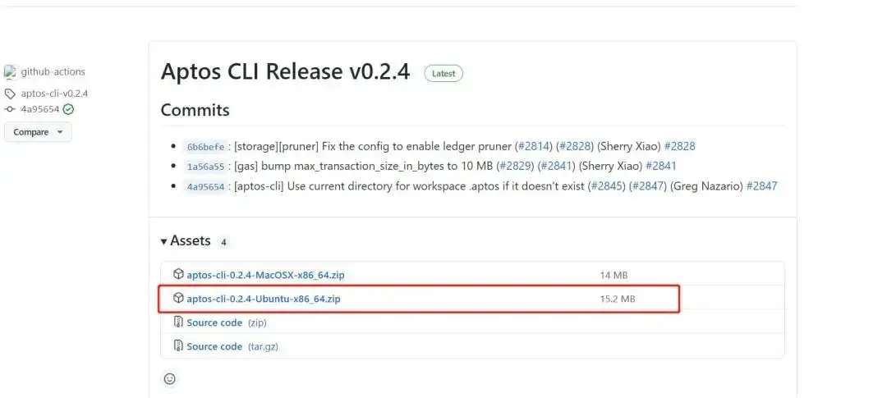
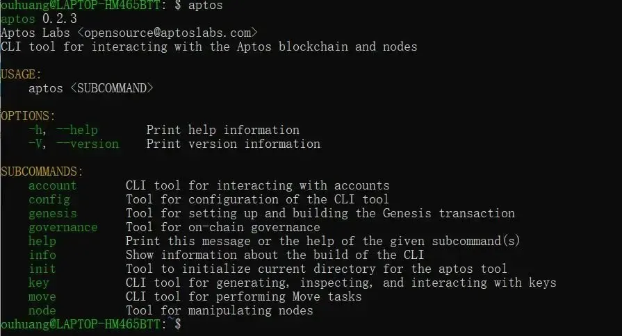

# Set up Aptos Environment 

## Install Aptos CLI

Để cài đặt Aptos CLI cho system của bạn, hãy truy cập các link sau:
- [**MAC**](https://aptos.dev/en/build/cli/install-cli/install-cli-mac)
- [**Windows**](https://aptos.dev/en/build/cli/install-cli/install-cli-windows)
- [**Linux**](https://aptos.dev/en/build/cli/install-cli/install-cli-linux)

Kiểm tra cài đặt bằng cách mở terminal và gõ lệnh:
```rust
 aptos --version
```

Bây giờ bạn đã sẵn sàng với các công cụ 🛠️ để xây dựng sản phẩm của mình trên Aptos! 

Đây là tài liệu từ Aptos document: https://aptos.dev/cli-tools/aptos-cli-tool/install-aptos-cli

**Giả sử gặp lỗi**, <span style={{ color: 'red', fontWeight: 500 }}>bạn có thể sử dụng một cách khác là cài đặt package đã pre-compiled để tiết kiệm thời gian hơn</span>




- Truy cập [trang release](https://github.com/aptos-labs/aptos-core/releases) của Aptos CLI. # Tải file nén
- Tải bản release mới nhất 
- Đặt file vào thư mục để chạy, ví dụ `~/bin/aptos` trên Linux. #Sau khi giải nén, copy aptos vào thư mục này
- Trên Linux và Mac, cấp quyền thực thi bằng lệnh `chmod +x ~/bin/aptos` #Cấp quyền cho file
- Gõ `~/bin/aptos help` để xem hướng dẫn sử dụng.
- Nếu muốn, bạn có thể thêm `~/bin.bashrc.zshrc` vào PATH trong file config phù hợp để dùng sau này.




Các bước để tạo một dự án blockchain thường gồm các thao tác cơ bản sau.

Tạo folder và viết file smart contract. Bạn có thể tham khảo cấu trúc thư mục của mình và tạo các folder, file tương ứng.


## Khởi tạo Aptos CLI

```bash
$ aptos init
Configuring for profile default
Enter your rest endpoint [Current: None | No input: https://fullnode.devnet.aptoslabs.com]

No rest url given, using https://fullnode.devnet.aptoslabs.com...
Enter your faucet endpoint [Current: None | No input: https://faucet.devnet.aptoslabs.com]

No faucet url given, using https://faucet.devnet.aptoslabs.com...
Enter your private key as a hex literal (0x...) [Current: None | No input: Generate new key (or keep one if present)]

No key given, generating key...
Account 50A49D913AA6381C01579E3FC00784B49AFA3A771F06389EBC65F8FF3A4E9A7D doesn't exist, creating it and funding it with 10000 coins
Aptos is now set up for account 50A49D913AA6381C01579E3FC00784B49AFA3A771F06389EBC65F8FF3A4E9A7D!  Run `aptos help` for more information about commands

{
  "Result": "Success"
}
```

> Một thư mục local tên .aptos/ sẽ được tạo ra cùng với file config.yaml để lưu trữ các cấu hình trong quá trình chạy CLI. Đây là file local trong runtime của bạn, nên bạn cần tiếp tục chạy CLI từ thư mục này, hoặc khởi tạo lại ở thư mục khác.

###  Start a local test network and configure the CLI

Start the local test chain:

```bash
$ aptos node run-local-testnet --with-faucet
Building genesis with 1 validators. Directory of output: "/Users/liaohua/aptos/.aptos/testnet"
Completed generating configuration:
	Log file: "/Users/liaohua/aptos/.aptos/testnet/validator.log"
	Test dir: "/Users/liaohua/aptos/.aptos/testnet"
	Aptos root key path: "/Users/liaohua/aptos/.aptos/testnet/mint.key"
	Waypoint: 0:81bffa64e06416fe9978f1e91d9f58e222836d303a3984dbd470d2c821a743b2
	ChainId: testing
	REST API endpoint: http://0.0.0.0:8080
	Metrics endpoint: http://0.0.0.0:9101/metrics
	FullNode network: /ip4/0.0.0.0/tcp/6181
Aptos is running, press ctrl-c to exit
Faucet is running.  Faucet endpoint: 0.0.0.0:8081
```

Tạo cấu hình tài khoản mới cho CLI. Lưu ý là không được đóng cửa sổ lệnh phía trên:

```bash 
$ aptos init --profile local --rest-url http://localhost:8080 --faucet-url http://localhost:8081
Configuring for profile local
Using command line argument for rest URL http://localhost:8080/
Using command line argument for faucet URL http://localhost:8081/
Enter your private key as a hex literal (0x...) [Current: None | No input: Generate new key (or keep one if present)]

No key given, generating key...
Account 4a327db3bce440f47d65b293a9688a7fd59e69a3cc1ddf0b2889a3e4f6d4de62 doesn't exist, creating it and funding it with 10000 coins
Aptos is now set up for account 4a327db3bce440f47d65b293a9688a7fd59e69a3cc1ddf0b2889a3e4f6d4de62!  Run `aptos help` for more information about commands
{
  "Result": "Success"
}
```

Reset local test chain:
```bash
$ aptos node run-local-testnet --with-faucet --force-restart
```

### Account Management

```bash 
$ aptos account fund-with-faucet
{
  "Result": "Added 100000000 Octas to account 0x3cd1d08a50289839fcf5a864e1d1eba5a22e2e6e50b7ba9c8501a317b49ac777"
}

$ aptos account create-resource-account --seed 1
Do you want to submit a transaction for a range of [97300 - 145900] Octas at a gas unit price of 100 Octas? [yes/no] >
yes
Transaction submitted: https://explorer.aptoslabs.com/txn/0xc4d69480c1e921488bfeaae4e6cfe9da46d6ad33198c9c2ba5314b99b0e12d3b?network=local
{
  "Result": {
    "resource_account": "4c83a95ae6040126c227c93f091fb36db1514d758c0173a173aae302574c65bb",
    "transaction_hash": "0xc4d69480c1e921488bfeaae4e6cfe9da46d6ad33198c9c2ba5314b99b0e12d3b",
    "gas_used": 973,
    "gas_unit_price": 100,
    "sender": "3cd1d08a50289839fcf5a864e1d1eba5a22e2e6e50b7ba9c8501a317b49ac777",
    "sequence_number": 0,
    "success": true,
    "timestamp_us": 1736913741893313,
    "version": 47986,
    "vm_status": "Executed successfully"
  }
}

```

Resource Account là tài khoản mà quyền sở hữu được kiểm soát bởi một resource và có thể được lưu trữ trong một tài khoản. Thông qua Resource Account chúng ta có thể triển khai các chức năng tương tự như tài khoản hợp đồng trong Solidity.


### Resource View

Để xem resource các bạn có thể dùng lệnh này: 

```bash 
aptos account list --query resources --account default 
{
  "Result": [
    {
      "0x1::coin::CoinStore<0x1::aptos_coin::AptosCoin>": {
        "coin": {
          "value": "10000"
        },
        ...
]}

# hoặc dùng account list thôi 
```

### Module view 

Có nhiều loại truy vấn khác nhau để xem các project khác nhau trong một tài khoản. Hiện tại chỉ hỗ trợ truy vấn "resources" và "modules", nhưng sẽ có thêm nhiều loại truy vấn mới trong tương lai. Ví dụ, để xem các module:

```rust 
$ aptos account list --query modules
```

### Transfer by aptos cli 


### Contract Compilation


Mình tạo một code `HelloAptos.move` với module như sau: 

```rust 
module HelloAptos::Message{

  use std::string;
  use std::error;
  use std::debug;
  use aptos_std::event;
  use std::signer;
  struct  Message has key{
      msg:string::String,
      message_change_events: event::EventHandle<MessageEvent>,
  }
  struct MessageEvent has drop, store {
      from_message: string::String,
      to_message: string::String,
  }

  const ENO_MESSAGE: u64 = 0;

  public entry fun  say_message(account:&signer, message_bytes: vector<u8>) acquires Message {
      let message = string::utf8(message_bytes);
      let account_addr = signer::address_of(account);
      if (!exists<Message>(account_addr)) {
          debug::print(&account_addr);
          move_to(account, Message {
             msg:message,
             message_change_events: event::new_event_handle<MessageEvent>(account),
          });
      } else {
          // debug::print(message);
          let old_message = borrow_global_mut<Message>(account_addr);
          let from_message = *&old_message.msg;
          event::emit_event(&mut old_message.message_change_events, MessageEvent {
              from_message,
              to_message: copy message,
          });
          old_message.msg = message;
      }

  }
  public fun get_message(addr: address): string::String acquires Message {
      assert!(exists<Message>(addr), error::not_found(ENO_MESSAGE));
      *&borrow_global<Message>(addr).msg
  }

  #[test(account = @0x1)]
  public entry fun sender_can_set_message(account: signer) acquires Message {
      let addr = signer::address_of(&account);
      say_message(&account,  b"Hello, Aptos");

      assert!(
        get_message(addr) == string::utf8(b"Hello, Aptos"),
        ENO_MESSAGE
      );
  }
}
```

Và move.toml: 

```rust 
[package]
name = "hello-aptos"
version = "0.0.0"
[dependencies]
AptosFramework = { git = "https://github.com/aptos-labs/aptos-core.git", subdir = "aptos-move/framework/aptos-framework/", rev = "devnet" }
[addresses]
HelloAptos = "fbd4140a63e8fe7d6e9e25aff78e11876b1b6c21bc8d34b51cbfff40ca03164b" 
```

> Trong đó fbd4140a63e8fe7d6e9e25aff78e11876b1b6c21bc8d34b51cbfff40ca03164b cần được thay thế bằng thông tin tài khoản của bạn.
