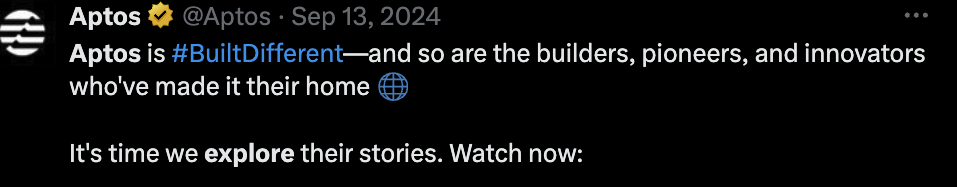
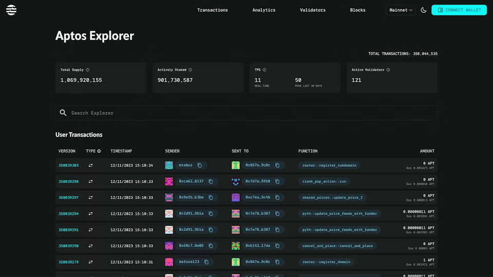
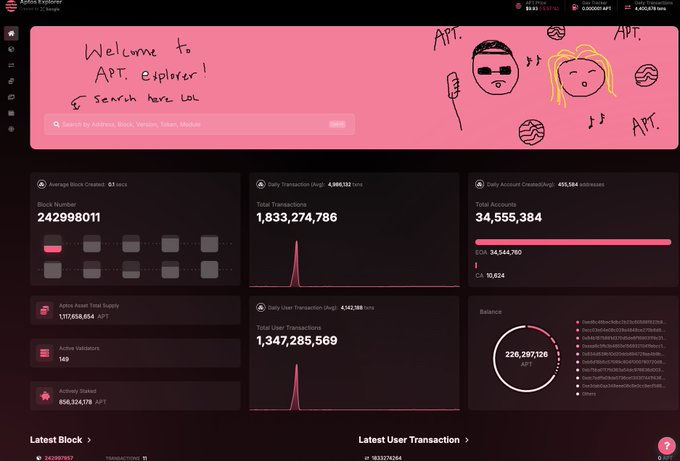

> Aptos is Built Different - Let's Explore the Aptos Explore

# Giới thiệu về Aptos Explorer 

Một trong những tính năng chính của blockchain Aptos là khả năng tra cứu thông tin tài khoản và các dữ liệu on-chain khác.

## Thông qua việc sử dụng Aptos Explorer

[Aptos Explorer](https://explorer.aptoslabs.com/?network=mainnet) là tool trên trình duyệt cho phép  khám phá dữ liệu on chain, như thông tin tài khoản, giao dịch và các events. Bạn có thể tìm kiếm theo địa chỉ ví, mã hash giao dịch hoặc số block để xem thông tin chi tiết.

Để sử dụng:

1. Truy cập vào Aptos Explorer.
2. Nhập địa chỉ ví hoặc mã hash giao dịch bạn muốn tra cứu vào thanh tìm kiếm.
3. Xem số dư tài khoản, lịch sử giao dịch và các sự kiện trên chuỗi liên quan đến địa chỉ hoặc giao dịch đó.

Như vậy Aptos Explorer cung cấp góc nhìn thời gian thực về trạng thái mạng lưới và hoạt động liên quan đến các thực thể on-chain cốt lõi. Công cụ này phục vụ các đối tượng và mục đích sau:

- Dev có thể hiểu được hành vi của smart contract và luồng giao dịch giữa người gửi-người nhận.
- Người dùng phổ thông có thể xem và phân tích hoạt động của blockchain Aptos qua các thành phần chính - giao dịch, block, tài khoản và tài nguyên.
- Validator có thể kiểm tra tình trạng mạng lưới và tối ưu hóa giá trị vận hành node.
- Người nắm giữ token có thể tìm validator tốt nhất để ủy thác token và nhận phần thưởng staking.

Để hiểu các hoạt động này, bạn đọc thêm ở đây: https://legacy.aptos.dev/guides/explore-aptos/

Một cách khác là chúng ta có thể sử dụng SDK của Aptos: 
1. Aptos Rest API - api để có thể tìm kiếm những gì đang có ở on chain 
2. View functions - đọc các move functions để trả về kết quả. Ví dụ: https://aptos.dev/en/build/smart-contracts/reference?page=aptos-token-objects%2Fdoc%2Ftoken.md#function-collection_name
3. Indexer data - Dữ liệu được lập chỉ mục để theo dõi thông tin token và lịch sử giao dịch

# Ngoài Aptos explorer offical ra thì còn có explorer của dev phát triển

Bạn có thể truy cập thêm vào website này: https://aptos-explorer.xangle.io/

Hoặc một số Explorers khác trên Aptos: https://aptosfoundation.org/ecosystem/projects/explorers

Lời cuối cho anh em Aptos dev sau bài học này là: 

> Let's make the Aptos Explorer better together by building more transactions with your dApps

Contribute ở đây nhé: https://github.com/aptos-labs/explorer
