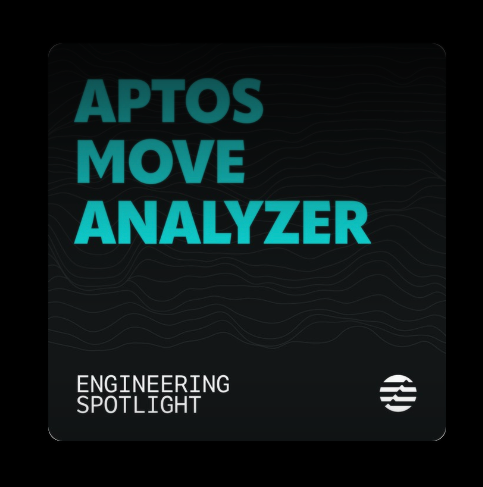

## Giới thiệu Aptos Move Analyzer plugin 





Plugin này nhằm nâng cao trải nghiệm phát triển cho dev  sử dụng ngôn ngữ Move.

Plugin Aptos Move Analyzer hiện đã có mặt trên Visual Studio Code, mang đến môi trường dev thân thiện và hiệu quả hơn. Plugin được thiết kế để tối ưu việc phát triển Move, cung cấp các tính năng như "Go to Definition", "Go to Type Definition", "Hover", "Autocomplete" và hỗ trợ identifier toàn diện để code không bị lỗi. Ngoài ra, nó cho phép quản lý nhiều file Move.toml một cách mượt mà trong workspace.

Plugin được phát triển dựa trên đóng góp từ MoveBit - đơn vị nhận tài trợ từ Quỹ Hệ sinh thái Aptos.

Bạn hãy truy cập vào đây: https://marketplace.visualstudio.com/items?itemName=MoveBit.aptos-move-analyzer


## Hướng dẫn cài đặt 

Extension `aptos-move-analyzer` trên Visual Studio Code hoạt động thông qua 2 thành phần: `aptos-move-analyzer language server` và extension.

Từ phiên bản v1.0.2, plugin sẽ tự động tải lsp-server (gói binary aptos-move-analyzer) khi bạn cài đặt từ VS Code marketplace. Mặc định, nó được tải về thư mục ~/.cargo/bin. Nếu quá trình tải thất bại, bạn có thể chọn cách tải thủ công được hướng dẫn bên dưới.

### Sử dụng Cargo

Language server `aptos-move-analyzer` là một chương trình Rust, nên khuyến nghị cài đặt qua `cargo`. Nếu chưa có Rust toolchain, bạn cần cài [Rustup](https://rustup.rs/) để có được bản Rust stable mới nhất kèm `cargo`.

**Chạy lệnh sau để cài đặt `aptos_move_analyzer`**

```
cargo install --git https://github.com/movebit/aptos-move-analyzer --branch release/aptos-move-analyzer aptos-move-analyzer
```

Quá trình cài đặt có thể mất vài phút. Sau khi cài xong, binary `aptos-move-analyzer` sẽ nằm trong thư mục bin của cargo. Trên macOS và Linux, thường là `~/.cargo/bin`. Đảm bảo thêm đường dẫn này vào biến môi trường `PATH` bằng lệnh `export PATH="$PATH:~/.cargo/bin"`.

Để kiểm tra cài đặt thành công, chạy lệnh `aptos-move-analyzer --version` trong terminal. Output sẽ là `aptos-move-analyzer version number(1.0.1)`. Nếu không thấy, xem phần xử lý lỗi ở cuối.

Sau khi hoàn tất các bước trên, **khởi động lại** VSCode.


### Cài đặt extension `aptos-move-analyzer` trên Visual Studio Code

1. Mở VS Code phiên bản 1.55.2 trở lên.
2. Mở Command Palette (phím tắt `⇧⌘P` trên macOS, hoặc vào *View > Command Palette...*) và gõ **Extensions: Install Extensions**. Panel *Extensions* sẽ hiện ra ở sidebar.
3. Trong ô tìm kiếm *Search Extensions in Marketplace*, gõ **aptos-move-analyzer**. Extension sẽ xuất hiện trong danh sách bên dưới. Nhấn **Install**.
4. Mở một thư mục project Aptos Move bất kỳ (nơi chứa file Move.toml), tạo hoặc mở file `.move`, bạn sẽ thấy syntax highlighting và các tính năng khác.

Sau khi hoàn thành các bước trên, **khởi động lại** VS Code.

Lúc này plugin đã sẵn sàng để sử dụng. Bạn có thể tùy chỉnh các cài đặt của plugin bằng cách vào (Preferences > Settings) và tìm kiếm "aptos-move-analyzer".