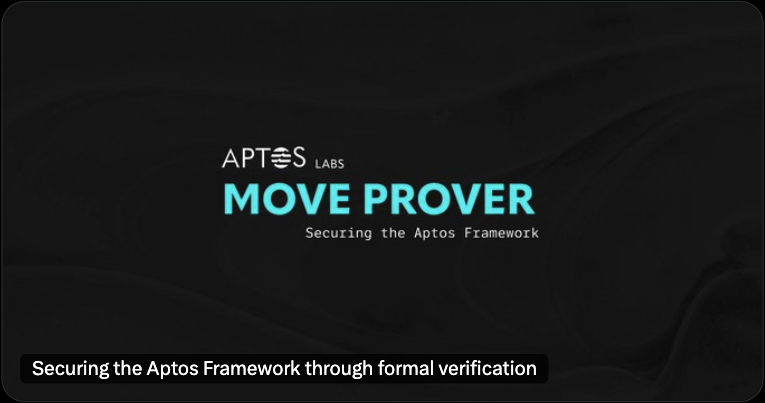
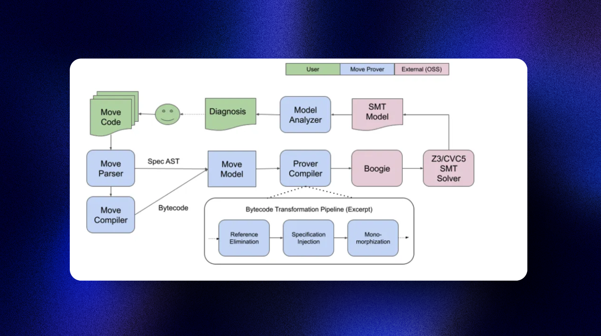

# Bài viết này hơi advanced nhưng nó nên có trong section này  


import RedHighlight from '../../components/RedHighlight'


 <RedHighlight> Đó là Aptos Mover.  </RedHighlight>

 > The Move prover is a formal verifier for smart contracts written in the Move language, which provides additional protection 🛡 for contract invariants and their behavior.


 Dịch ra là Move prover là một công cụ để **verify tính đúng đắn của smart contract được viết bằng ngôn ngữ Move**. Move prover giúp đảm bảo các smart contract hoạt động chính xác thông qua việc chứng minh toán học tính đúng đắn của code.

 Move prover hoạt động bằng cách tự động verify rằng code smart contract tuân thủ các thuộc tính nhất định, ví dụ như không cho phép integer overflow hoặc underflow. Nó cũng kiểm tra code không có các lỗi như reentrancy vulnerabilities và lỗi chia cho 0. Nếu Move prover phát hiện bất kỳ vi phạm nào, nó sẽ báo cáo lại cho developer để họ có thể sửa code trước khi deploy.


 Move Prover tồn tại để làm cho các contract đáng tin cậy hơn; nó:

- Bảo vệ khối lượng tài sản lớn được quản lý bởi blockchain Aptos khỏi các lỗi smart contract
- Đáp ứng các yêu cầu giám sát và tuân thủ quy định
- Cho phép experts có nền tảng toán học, không nhất thiết phải có background về software engineering, có thể hiểu được smart contract hoạt động như thế nào


```rust
module my_addrx::Example{
    struct Counter has key {
        value: u8,
    }

    public fun increment(a: address) acquires Counter {
        let c = borrow_global_mut<Counter>(a);
        c.value = c.value + 1;
    }

    spec increment {
        aborts_if !exists<Counter>(a);
        ensures global<Counter>(a).value == old(global<Counter>(a)).value + 1;
    }
}
```

Move Prover được gọi thông qua CLI của Aptos.

Gọi Move Prover từ thư mục cần kiểm tra hoặc bằng cách chỉ định đường dẫn thông qua tham số `--package-dir`:

- Kiểm tra code của package trong thư mục hiện tại:

```bash
aptos move prove

// hoặc dùng 

aptos move prove --package-dir <path>
```

Khi chạy lệnh `aptos move prove` cho code trên, sẽ xuất hiện lỗi sau:

```rust
error: abort not covered by any of the `aborts_if` clauses
   │  
 8 │           c.value = c.value + 1;
   │                             - abort happened here with execution failure
   ·  
11 │ ╭     spec increment {
12 │ │         aborts_if !exists&lt;Counter&gt;(a);
13 │ │         ensures global&lt;Counter&gt;(a).value == old(global&lt;Counter&gt;(a)).value + 1;
14 │ │     }
   │ ╰─────^
{
  "Error": "Move Prover failed: exiting with verification errors"
```

Move Prover đã tạo ra một ví dụ counter dẫn đến tràn số khi cộng 1 vào giá trị 255 của kiểu `u8`. Lỗi tràn số này xảy ra khi function specification yêu cầu hành vi abort, nhưng điều kiện khiến function abort lại không được cover trong specification. Thực tế, với `aborts_if !exists<Counter>(a)`, chúng ta chỉ cover trường hợp abort do resource không tồn tại, mà không cover trường hợp abort do tràn số trong phép tính.

Mình sẽ sửa sau: 
```rust
spec increment {
    aborts_if global<Counter>(a).value == 255;
    ...
}
```

Với điều kiện này, Move Prover sẽ chạy thành công mà không gặp lỗi nào

# Kiến trúc của Move prover 

Kiến trúc tổng thể của Move Prover được thể hiện trong sơ đồ sau: 




Cách mà Move prover hoạt động dựa trên kiến trúc trên sẽ là 
* Step 1: Nhận file code Move làm đầu vào
* Step 2: Move parser sẽ lấy specification( Đặc tả) từ code move 
* Step 3: Move compiler sẽ convert sang dạng bytecode rồi kết hợp giữa đặc tả(specification) và bytecode thành Prover Object Model. 
    * Chuyển đổi thành ngôn ngữ trung gian Boogie
    * Boogie thực hiện "verification condition generation"


* Step 4: Quá trình xác minh:
    * Sử dụng Z3 (SMT solver của Microsoft) để kiểm tra công thức
    * Nếu công thức không thỏa mãn -> đặc tả đúng
    * Nếu thỏa mãn -> tạo mô hình và báo cáo lỗi

Bạn có thể đọc thêm ở đây: https://www.numencyber.com/security-analysis-of-the-move-language-game-changer-of-smart-contracts/ 