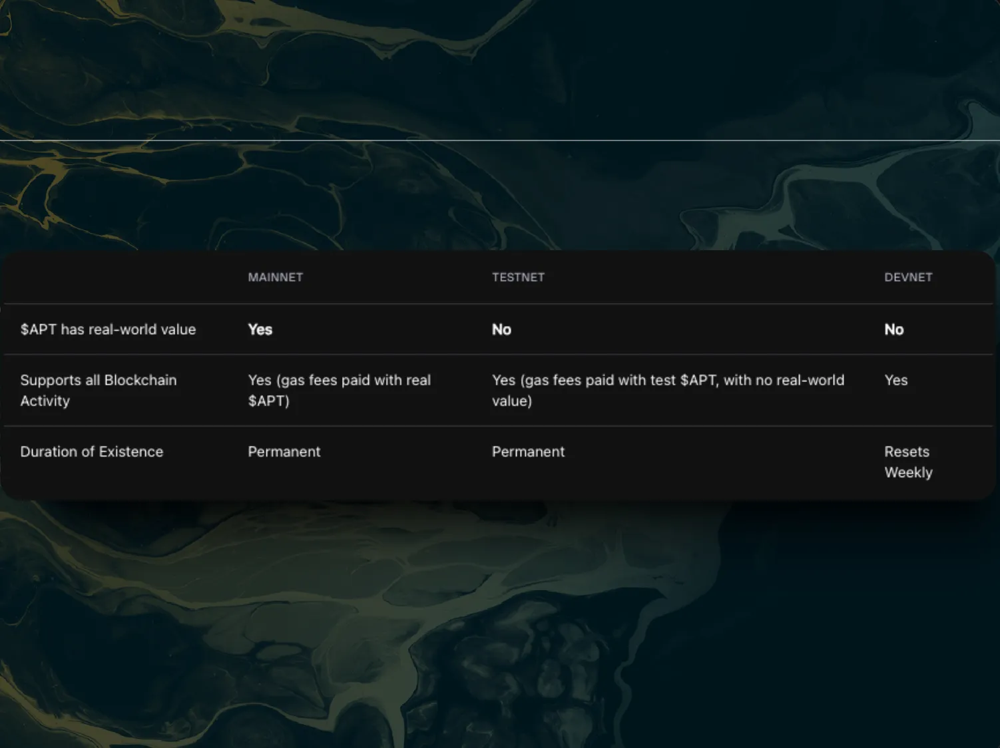
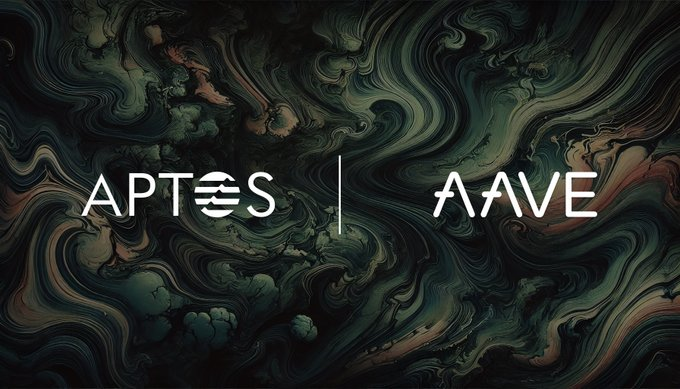
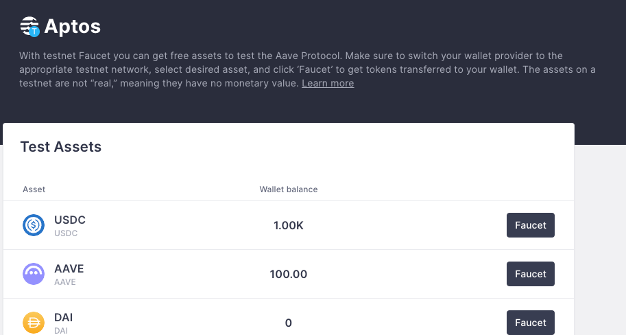

# Network ở trong Aptos

Trong phần này, chúng ta sẽ tìm hiểu sự khác biệt giữa mainnet, testnet và devnet trên blockchain Aptos và cách tận dụng chúng cho các mục đích khác nhau

- **Mainnet:** Khi nói đến blockchain Aptos, chúng ta đang đề cập đến mainnet. Đây là blockchain chính thức được sử dụng cho các giao dịch và tài sản thực.
- **Testnet:** Đây là mạng blockchain thử nghiệm, hoạt động như một sandbox để các developer có thể thử nghiệm mà không ảnh hưởng đến tài sản thật hoặc mainnet.
- **Devnet:** Devnet hoạt động tương tự như testnet, nhưng được reset hàng tuần. Nếu bạn deploy smart contract lên devnet, hãy chuẩn bị tinh thần là nó sẽ bị xóa trong đợt reset hàng tuần (Bạn sẽ cần deploy lại contract).

Mình recommend mọi người nên phát triển và debug ở trên testnet trước khi mình ready để publish lên smart contract và proceed để deploy lên mainnet.

Bạn có thể đọc https://aptos.dev/en/network/nodes/networks

# Aave V3 on Aptos testnet 

Aave Labs đã triển khai thành công Aave V3 trên testnet của Aptos, sử dụng ngôn ngữ lập trình Move. Đây là tin tức mới trong đầu năm 2025

Bạn truy cập Aave V3 trên Aptos: https://aptos.aave.com/

Lợi ích của điều này là vì Đây là lần đầu tiên Aave được triển khai trên một blockchain không phải EVM (Ethereum Virtual Machine). Điều này rất quan trọng vì nó mở rộng ranh giới công nghệ và đa dạng hóa hệ sinh thái của Aave.

Các lợi ích chính khi triển khai trên Aptos:

* Triển khai Non-EVM đầu tiên: Đây là một cột mốc quan trọng khi Aave vượt ra khỏi các blockchain tương thích EVM
Giúp Aave có thể khám phá và tích hợp với các hệ sinh thái blockchain mới. Tăng cường khả năng phục hồi và mở rộng phạm vi hoạt động

* Lợi thế người đi đầu và thương hiệu mạnh: Aave là thương hiệu hàng đầu trong DeFi với uy tín và thị phần lớn. Việc triển khai sớm trên Aptos giúp Aave có lợi thế trên một blockchain hiệu năng cao
Có thể thu hút cả người dùng DeFi có kinh nghiệm và người mới tham gia Aptos

Đọc chi tiết thêm ở đây: https://governance.aave.com/t/temp-check-aave-v3-deployment-on-aptos-mainnet/18124/18?u=aavelabs