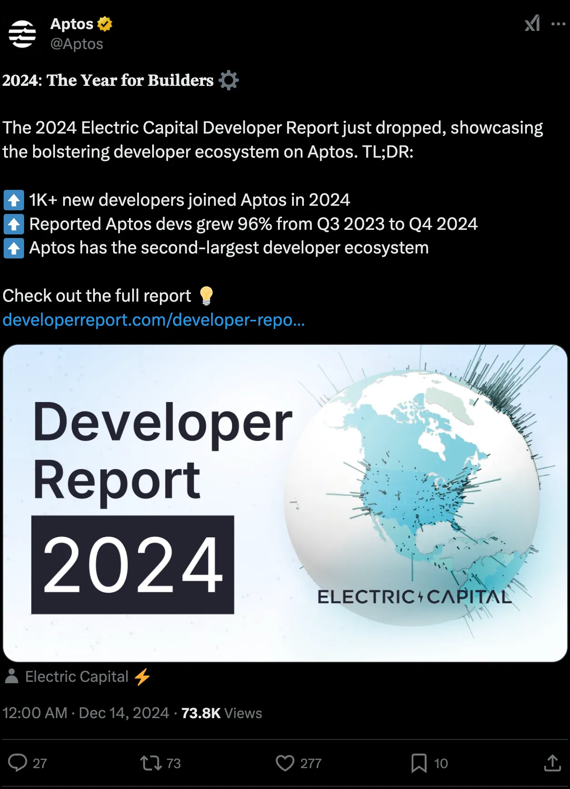
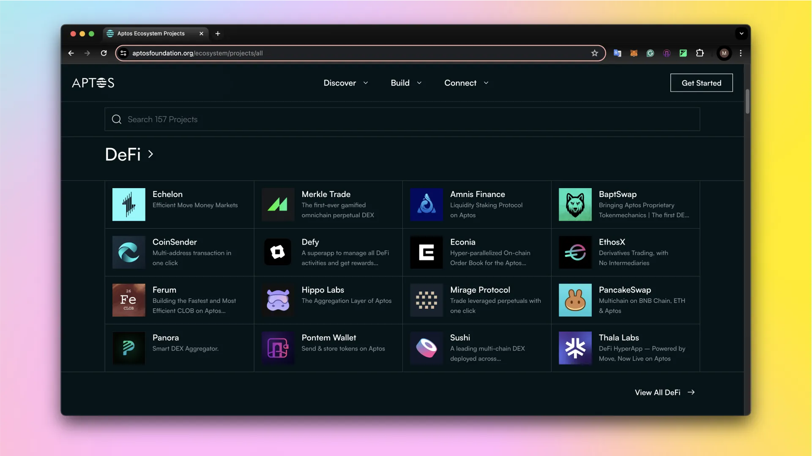
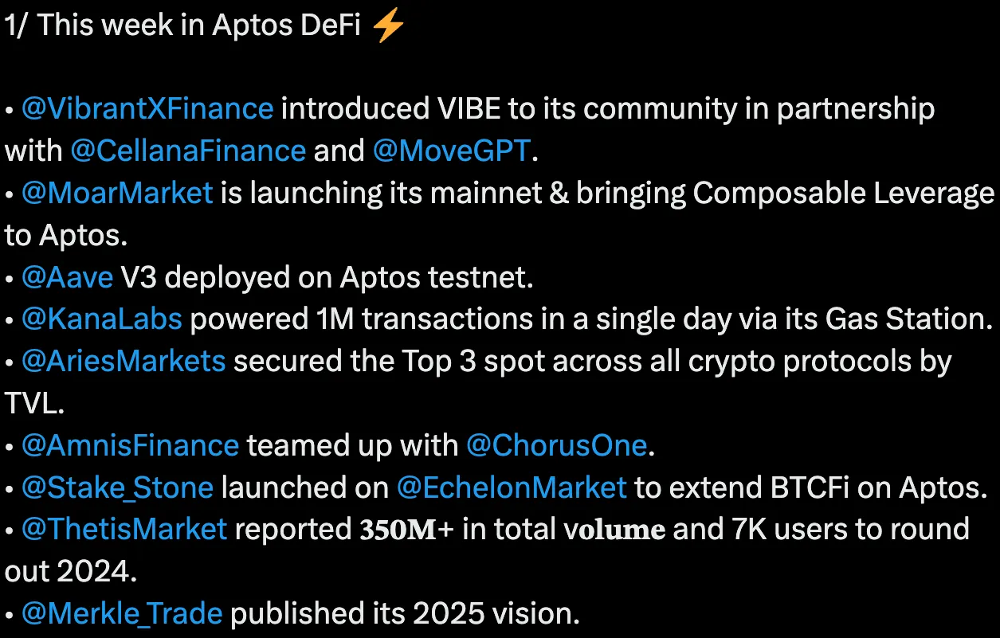

Nếu bạn đang đọc những dòng này thì chắc hẳn bạn đã tìm hiểu về nguồn gốc của Aptos, nắm được những kiến thức cơ bản về protocol và cuối cùng đã đến được đây. Trong bài học này, chúng ta sẽ tìm hiểu về một số ứng dụng thú vị được xây dựng trên nền tảng Aptos, để bạn có thêm cảm hứng để tự mình build cùng Aptos nhé. 

Năm 2024 qua cho thấy được số lượng dev tham gia vào Aptos protocol cho thấy được tiềm năng của Aptos. Điều này cho thấy Aptos rất tập trung vào developer để có thể giúp đỡ các bạn build một hệ sinh thái blockchain khỏe mạnh, cùng lượng người dùng tích cực cao trong các ứng dụng đó cho thấy mức độ adoption cao. 

Hệ sinh thái Aptos có cả hai yếu tố: **số lượng ứng dụng tốt và lượng user cao.** Nội dung trong bài học này sẽ là điểm qua  một số ứng dụng nổi bật trong hệ sinh thái Aptos và tìm hiểu xem tại sao chúng phát triển mạnh mẽ nhờ vào nền tảng Aptos. 

Dưới đây là một số danh mục ứng dụng được ưa chuộng nhất trong hệ sinh thái Aptos:

## DeFi (Decentralized Finance)

Bạn có thể truy cập vào Aptos defi projects: https://aptosfoundation.org/ecosystem/projects/defi để xem danh sách các dự án. 

Tuy nhiên mình cũng đề xuất các bạn follow twitter của Aptos để nắm những thông tin mới nhất ví dụ như: 

Hệ sinh thái DeFi của Aptos đang phát triển mạnh mẽ, cho phép các developer xây dựng các công cụ và hệ thống financial mới. Một ví dụ điển hình là Amnis Finance - một trong những protocol DeFi lớn nhất trên Aptos với hơn 57 triệu USD TVL (Tổng giá trị khóa). Đây là protocol liquid staking cho phép người dùng tận dụng token SAPT (Staked APT) của họ. Thú vị là protocol này được phát triển từ một hackathon của Aptos - cho thấy tiềm năng phát triển ngay cả khi bạn mới bắt đầu với Aptos! 

Trong khi các DApp giống như Amnis đã tồn tại trên các blockchain khác, **Econia** sẽ là một ví dụ về protocol chỉ có thể xây dựng trên Aptos. Đây là một **orderbook hiệu năng cao được thiết kế riêng cho Aptos**, tận dụng Move và Block-STM để cung cấp cho traders hiệu suất cao, khả năng composability và tích hợp mượt mà với các protocol khác. 

Econia có matching engine nguyên tử sử dụng finality dưới 1 giây của Aptos để xử lý giao dịch **ngay lập tức khi được đặt lệnh**. Việc cô lập state của các thị trường khác nhau vào các vùng riêng biệt trong bộ nhớ toàn cục giúp nó có khả năng song song hóa cao, mang lại hiệu suất đột phá. 

Bạn có thể xem ở đây: https://aptosfoundation.org/ecosystem/projects/defi