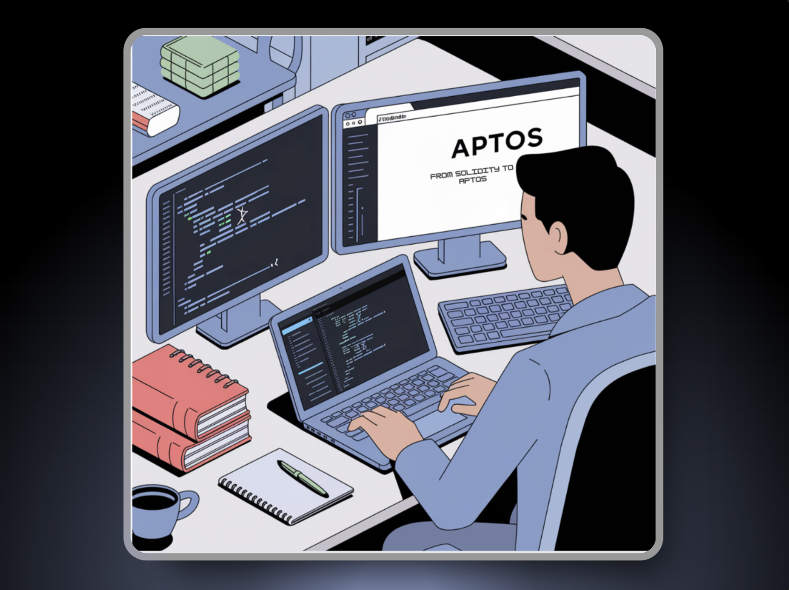
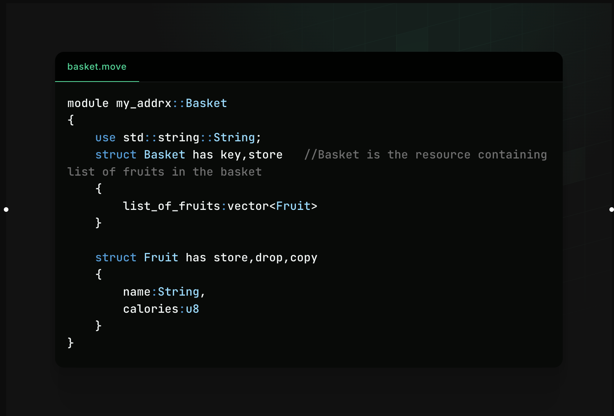

## From Solidity to Aptos 
Khi giải thích về Move, mọi người sẽ nghĩ ngay đến rust. Sự thật thì Move được phát triển tương tự vơi rust. Vì thế chúng mình sẽ có những so sánh đầu tiên với 2 ngôn ngữ giữa Solidity và Move. 




Nếu bạn có kiến thức về Solidity, đây là hai điểm so sánh thú vị:

1. **Solidity theo hướng contract trong khi Move theo hướng resource.**

    a. Với Solidity, mọi thứ đều xoay quanh smart contract: state và behavior đều được đóng gói trong smart contract.

    b.  Ngược lại, Move xử lý các thứ như token dưới dạng tài nguyên thực. "Resource" ở đây nghĩa là tài nguyên có giá trị. Đây là một cải tiến quan trọng, vì nó giải quyết được các lỗ hổng phổ biến trong Solidity như double spending. 

> Giống như **định luật bảo toàn năng lượng** trong Vật lý - năng lượng không thể tạo ra hay mất đi, Move ngăn chặn double-spend ở cấp độ code bằng cách đảm bảo resource không thể được tạo ra từ hư vô.


2. **Token trong Solidity luôn là custom trong khi Move có cách implement thống nhất cho mọi token.**

    a. Mặc dù token Solidity có các chuẩn (như ERC721 hay ERC20), chúng có thể được implement khác nhau. Trên Aptos, mọi token đều được implement theo cùng một cách. 

    b. Điều này giống như sự khác biệt giữa thiết bị Android (Solidity) và iOS (Move). Thiết bị Android cần tuân theo spec để chạy Android, nhưng chúng có nhiều hình dạng và kích thước khác nhau (ví dụ: Samsung, Huawei, Nokia). Ngược lại, iOS chỉ chạy trên iPhone - có nhiều loại iPhone khác nhau, nhưng mỗi loại đều giống hệt nhau.


## Thế nào gọi là Resources trong Aptos Move? 

Move được thiết kế như **một ngôn ngữ lập trình hướng đối tượng để viết smart contract hoặc chương trình với khả năng quản lý tài nguyên an toàn**. Tài sản được định nghĩa như một "resource" (tài nguyên), có thể di chuyển giữa các tài khoản, nhưng không thể bị chi tiêu hai lần hoặc sao chép.

Điều này giúp việc viết code ít lỗi hơn, khác với Solidity - nơi mà việc chuyển tài sản phải được chỉ định thủ công, làm tăng khả năng viết code có lỗi.

**Resource** được xem là kiểu dữ liệu hoàn hảo để lưu trữ *tài sản số*. Để đạt được điều này, nó phải không thể sao chép (non-copyable) và không thể bị hủy (non-droppable). Đồng thời nó phải có khả năng lưu trữ và chuyển giao giữa các tài khoản.

Đây là đoạn code định nghĩa một Resource:

```rust
struct ResourceName has key, store {
        FIELD: TYPE
}
```

Dưới đây là một ví dụ code Aptos: 




## Parallel Processing giữa Move và Solidity 

Solidity và Move có cách tiếp cận xử lý và đồng thời khác nhau.

Trong Solidity, mô hình thực thi mặc định là xử lý tuần tự( sequential processing) , nghĩa là code được thực thi từng bước một theo thứ tự xuất hiện trong code. Điều này là do Solidity là ngôn ngữ đơn luồng, chỉ có thể thực thi một lệnh tại một thời điểm. Tuy nhiên, Solidity vẫn hỗ trợ xử lý bất đồng bộ thông qua events và callbacks, cho phép dev viết code chạy ngầm trong khi luồng chính đang thực thi code khác.

Ngược lại, Move có mô hình xử lý song song, cho phép nhiều luồng thực thi lệnh đồng thời. Điều này đạt được thông qua mô hình resource của Move, cho phép resources được di chuyển giữa các luồng khác nhau. Nghĩa là Move có thể thực thi nhiều lệnh cùng lúc, dẫn đến thời gian xử lý nhanh hơn và khả năng mở rộng tốt hơn.

Việc lựa chọn giữa xử lý tuần tự và song song ( sequential hay parallel processing) phụ thuộc vào yêu cầu cụ thể của ứng dụng đó.


## Quản lý bộ nhớ

Cách quản lý bộ nhớ trong Move và Solidity có sự khác biệt rõ rệt.

Move được thiết kế với cách tiếp cận độc đáo về quản lý bộ nhớ, trong đó quyền sở hữu dữ liệu được chuyển giao giữa các resource trong chương trình. Move sử dụng hệ thống kiểu tuyến tính (linear type system) để thực thi việc quản lý resource, nghĩa là mỗi resource chỉ có thể được sử dụng một lần. Điều này có nghĩa là khi một resource được di chuyển từ vị trí này sang vị trí khác, nó không thể được truy cập từ vị trí ban đầu nữa. Cơ chế này giúp ngăn chặn các vấn đề như data race và lỗi use-after-free, vốn thường gặp trong các ngôn ngữ lập trình khác.

Solidity sử dụng garbage collector để quản lý bộ nhớ, tự động giải phóng bộ nhớ khi không còn được sử dụng. Solidity không có khái niệm về quyền sở hữu hay kiểu tuyến tính, thay vào đó dựa vào hệ thống quản lý bộ nhớ heap-based tương tự như các ngôn ngữ lập trình thông thường khác.

Nhìn chung, cách tiếp cận quản lý bộ nhớ trong Move nghiêm ngặt hơn và đòi hỏi một cách tư duy khác về quyền sở hữu và sử dụng resource so với garbage collector của Solidity.


## Compiled language
Cả *Move* và *Solidity* đều là ngôn ngữ lập trình biên dịch (compiled), nhưng có một số điểm khác biệt.

Move là ngôn ngữ kiểu tĩnh (statically-typed) được phát triển bởi Meta. Nó chú trọng vào tính an toàn và bảo mật, với các tính năng như quản lý quyền sở hữu tài nguyên và cơ chế mượn (borrowing), đồng thời được tối ưu hóa về hiệu suất và phí gas thấp. Trình biên dịch Move tạo ra bytecode để chạy trên Move Virtual Machine.

Solidity là ngôn ngữ lập trình bậc cao hướng smart contract, được sử dụng để viết smart contract trên blockchain Ethereum. Nó cũng là ngôn ngữ kiểu tĩnh và được biên dịch, nhưng có thêm một số tính năng động. Trình biên dịch Solidity tạo ra bytecode để chạy trên Ethereum Virtual Machine (EVM).

Cả Move và Solidity có nhiều điểm tương đồng về cú pháp và cấu trúc, nhưng chúng được tối ưu hóa cho các blockchain và use case khác nhau. Về quy trình biên dịch, cả hai ngôn ngữ đều cần một bước biên dịch trước khi có thể chạy trên virtual machine tương ứng của blockchain.