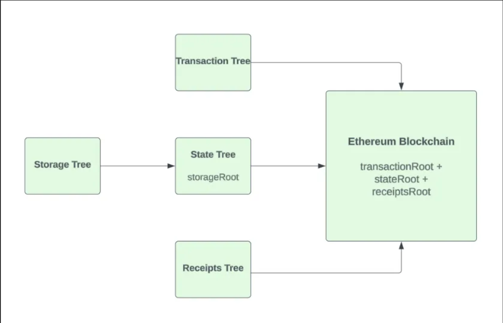
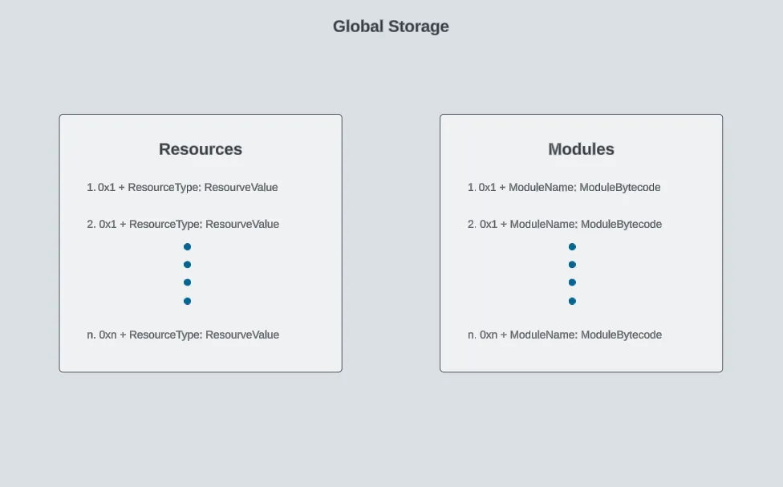

# Account  Data Storage Models trên Aptos và Ethereum


## Account models 

### Ethereum Accounts

Ethereum chia tài khoản thành hai loại:

1. Tài khoản sở hữu bên ngoài (EOA): Externally Owned Accounts
2. Tài khoản hợp đồng (Contract Account)

Các thành phần chính của tài khoản Ethereum:

- **Địa chỉ**: Mỗi tài khoản được xác định bằng địa chỉ 160-bit
- **Số dư**: Lưu trữ số tiền trong tài khoản
- **Số nonce**: Đếm số giao dịch đã trả phí gas
- **Trạng thái**: Được biểu diễn bằng gốc lưu trữ
- **Kiểm soát**:
    - Tài khoản hợp đồng: Được kiểm soát bởi mã EVM
    - Tài khoản EOA: Được kiểm soát bằng khóa riêng tư

### Aptos accounts 

Trong khi đó tài khoản Aptos đóng vai trò như một container chứa cả mã nguồn Move/smart contract (gọi là "modules") và các instances của các cấu trúc dữ liệu khác nhau (gọi là "resources").

Các thành phần chính:

- **Địa chỉ**: Sử dụng địa chỉ 256-bit
- **Modules và Resources**:
    - Modules: Chứa smart contract
    - Resources: Lưu trữ cấu trúc dữ liệu có kiểu
- **Số dư**: Không lưu trực tiếp mà thông qua resources, mỗi loại tài sản có một resource riêng
- **Số thứ tự**: Đếm số giao dịch đã gửi từ tài khoản
- **Kiểm soát**: Modules được kiểm soát bởi Move VM

## Data Storage Models

### Storage trên Ethereum 
Ethereum sử dụng cấu trúc [Patricia Merkle Tree](https://ethereum.org/en/developers/docs/data-structures-and-encoding/patricia-merkle-trie/) để lưu trữ dữ liệu. Hệ thống lưu trữ bao gồm 4 cây - cây World State (duy nhất, được cập nhật theo block), cây Storage (theo từng tài khoản, được cập nhật theo block), cây Transaction (tạo mới theo block) và cây Receipt (tạo mới theo block). Dưới đây là sơ đồ minh họa cách Ethereum lưu trữ dữ liệu:





### Storage trên aptos 

Ở Aptos, Storage hoạt động như thế nào dễ hiểu hơn. Trong Move, các chương trình đọc và ghi vào một cấu trúc lưu trữ toàn cục dạng cây. Dưới dạng pseudocode, nó trông như thế này:


```rust
struct GlobalStorage {
  resources: Map<(address, ResourceType), ResourceValue>
  modules: Map<(address, ModuleName), ModuleBytecode>
}
```
- Đầu tiên là vùng lưu trữ cho resources - mỗi entry trong map này được định danh bởi cặp địa chỉ tài khoản và ResourceType. Cặp này đóng vai trò như một nhãn duy nhất trỏ đến giá trị hoặc chi tiết của resource đó (ResourceValue).
- Thứ hai là vùng lưu trữ cho modules - đây là nơi lưu trữ code smart contract (module). Mỗi entry được định danh bởi cặp địa chỉ tài khoản và tên module được lưu trong tài khoản đó. Giá trị ở đây là bytecode của module.

Về mặt cấu trúc, bộ nhớ toàn cục được tổ chức dưới dạng rừng (forest), trong đó mỗi cây đại diện cho dữ liệu của một tài khoản trên blockchain. Mỗi cây có một điểm khởi đầu duy nhất, tương tự như cách mỗi cây trong rừng có vị trí riêng để phát triển. Mỗi cây "phân nhánh" thành các dữ liệu cụ thể liên quan đến tài khoản đó, ví dụ như modules và resources.



## Contract-Level Storage và Account-Centric Storage

Khi các dev Solidity chuyển sang Aptos, sẽ gặp thử thách đầu tiên là làm quen với các khái niệm lưu trữ và sở hữu dữ liệu mới như resources và objects. Những khái niệm này khác với Solidity nhưng phục vụ các mục đích tương tự. Việc hiểu rõ những khác biệt này là chìa khóa để học Aptos nhanh hơn và suôn sẻ. 

### Contract-Level Storage

Trong Solidity, dữ liệu được lưu trữ trong các slot bộ nhớ của smart contract. Để tạo một NFT, bạn thiết kế một contract dựa trên chuẩn ERC-721. Contract này đóng vai trò như một trung tâm, theo dõi quyền sở hữu thông qua các cấu trúc dữ liệu như mapping. Nó hoạt động như một sổ cái kỹ thuật số, lưu trữ cả code (logic) và data (trạng thái), đảm bảo mọi NFT đều được theo dõi và liên kết với chủ sở hữu của nó.

```rust
contract MyNFT is ERC721 {
    using Counters for Counters.Counter;
    Counters.Counter private _tokenIds;

    // Mapping from token ID to owner address
    // This mapping is inherently part of the ERC721 implementation
    // mapping(uint256 => address) private _owners; // In ERC721

    constructor() ERC721("MyNFT", "MNFT") {
        // code
    }

    // Function to mint a new NFT
    function mintNFT(address recipient) public returns (uint256) {
        _tokenIds.increment();
        uint256 newItemId = _tokenIds.current();

        // The _mint function updates the internal _owners mapping in ERC-721
        _mint(recipient, newItemId);

        return newItemId;
    }

    // Additional functions and contract logic...
}
```

Mỗi contract chứa các vị trí lưu trữ riêng cho các biến trạng thái của nó. Gốc lưu trữ( storage root) , được tính toán từ các vị trí này bằng cách sử dụng  Patricia Merkle tree, được ghi lại trong cây trạng thái toàn cục, với khóa là địa chỉ của  contract


### Account-Centric Storage: Containers

Trên Aptos, ngôn ngữ Move lưu trữ dữ liệu trong một cấu trúc lưu trữ toàn cục dạng tree-shaped global storage. Thay vì phân chia tài khoản thành hai loại (EOA và Contract Account) như Ethereum, mỗi tài khoản trên Aptos đóng vai trò như một container chứa cả modules (mã hợp đồng) và resources (dữ liệu). Khái niệm 'container' là chìa khóa để hiểu cách lập trình hiệu quả trong Move.

Thay vì kế thừa từ một contract như ERC-721, NFT được tạo ra dưới dạng objects. Hãy xem objects như các 'container' cho resources. Về cơ bản, các resource được nhóm lại để tạo thành một object. Object đó đại diện cho một NFT. Mỗi object được lưu trữ tại một địa chỉ duy nhất. . Đây là ý tưởng chính đằng sau hệ thống lưu trữ toàn cục kiểu 'container' của Aptos so với hệ thống lưu trữ cấp contract trên Ethereum.

Để hiểu rõ hơn khái niệm này, hãy xem ví dụ đơn giản về cách biểu diễn quyền sở hữu NFT bằng Move. Trong trường hợp này, chúng ta KHÔNG sử dụng Digital Asset Standard. Thay vào đó, chúng ta sẽ bỏ qua những phức tạp đó và sử dụng một resource đơn giản để biểu diễn NFT.

```rust
module 0x1::my_module {
    use std::signer; // Library in Move to use 'signers'
	  use std::string; // Library in Move to use strings

    // Define a simple NFT resource with an id and some metadata 
    // IN PRACTICE, YOU HAVE TO USE THE DIGITAL ASSET STANDARD TO DEFINE AN NFT
    struct NFT has key {
        id: u64,
        name: string::utf8("My NFT"),
    }
   // Public entry function to create a new NFT and store it in the creator's account
    public entry fun create_nft(account: &signer, id: u64, metadata: vector<u8>) {
        let nft = NFT { id, metadata };
        move_to(account, nft);
    }
}
```

Trong đoạn code trên thì Struct NFT là một resource. Để ý việc sử dụng move_to(account, nft). Đây là một trong những toán tử storage toàn cục đã được đề cập ở phần trước. Tham số account này đóng vai trò như một 'container' lưu trữ cho resource NFT mới được mint. 

Resource này có thể được xem dưới một tài khoản trên Aptos Block Explorer. Nhìn chung, cách này khác biệt về mặt trực quan và cấu trúc so với việc lưu thông tin quyền sở hữu ở cấp độ contract bằng các biến trạng thái (mapping để theo dõi quyền sở hữu).