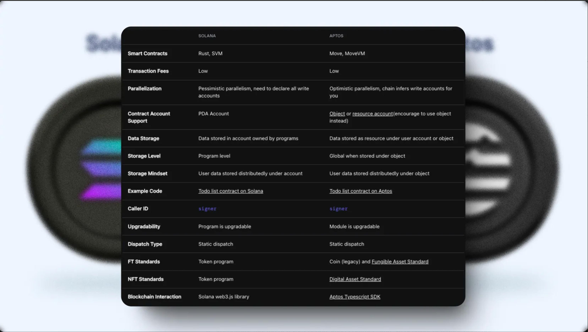
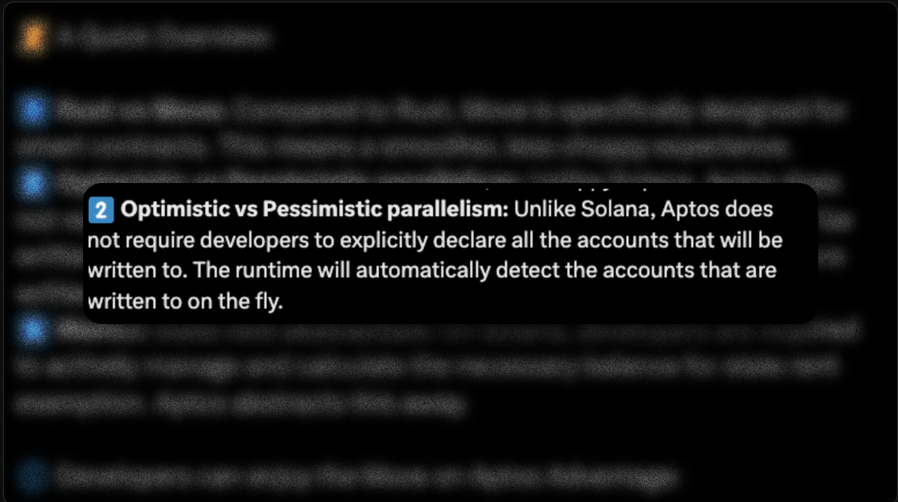

## From Solana to Aptos 

Trên đây là Solana to aptos cheat sheet. Aptos và Solana đều là các blockchain được thiết kế để đạt hiệu năng cao và khả năng mở rộng tốt. Nhiều concept và các quyết định thiết kế trên Solana cũng được áp dụng trên Aptos. Bây giờ chúng ta hãy đi sâu vào chi tiết về những điểm tương đồng và sự khác nhau nhé: 

## Điểm tương đồng

Những điểm tương đồng của Solana và aptos là cả Aptos và Solana đều có kiểu dữ liệu signer bổ sung cho kiểu address và sử dụng signer làm kiểu người gửi trong giao dịch thay vì address. 

Khi người dùng gọi một hàm trong transaction, họ truyền signer vào hàm và hàm có thể chuyển signer này cho các hàm khác. Miễn là một hàm có signer, nó có thể thực hiện các hoạt động thay mặt người dùng (ví dụ: chuyển APT từ tài khoản người dùng sang tài khoản khác, ngay cả trong một hàm không được người dùng gọi trực tiếp).

Tương tự với [Token Program](https://spl.solana.com/token) trên Solana, Aptos hỗ trợ fungible token thông tqua Coin Standard là `0x1::coin` và  `Fungible Asset Standard` at `0x1::fungible_asset`, và non-fungible token via the `Digital Asset Standard` at `0x4::token`. Chỉ những tài sản được tạo ra bởi các module này mới được coi là tài sản hợp lệ. Điều này giúp tránh việc lặp lại code và đảm bảo tất cả các tài sản hoặc token đều có cùng một interface, hành vi và các đảm bảo về bảo mật.

Trên Solana, dữ liệu được lưu trữ trong các account do các program sở hữu. Để cải thiện hiệu suất của ứng dụng và tận dụng tối đa việc xử lý song song, các dev thường lưu trữ state ứng dụng theo hình thức phân tán. Ví dụ trong ứng dụng todo list, danh sách việc cần làm của **mỗi người dùng được lưu trong một account riêng biệt**. Cách này cho phép blockchain xử lý đồng thời nhiều người dùng cập nhật todo list của họ.

Trên Aptos, mặc dù **dữ liệu có thể được lưu trực tiếp trong tài khoản người dùng**, Aptos khuyến khích dev lưu trữ trạng thái ứng dụng theo hình thức phân tán thông qua Object. Ví dụ trong ứng dụng todo list, danh sách việc cần làm của mỗi người dùng được lưu trong một object riêng biệt. Tương tự như Solana, cách này cho phép blockchain xử lý đồng thời nhiều người dùng cập nhật todo list của họ.

## Điểm khác biệt 

Vì Aptos là blockchain mới hơn nên có thể học hỏi từ những nền tảng đi trước như Ethereum và Solana. Dưới đây là một số điểm khác biệt đáng chú ý giúp cải thiện trải nghiệm cho developer.

### Ngôn ngữ Smart Contract

Aptos sử dụng ngôn ngữ Move cho smart contract. So với ngôn ngữ lập trình thông thường như Rust, Move được thiết kế đặc biệt cho việc viết smart contract trên blockchain. Move sử dụng mô hình lập trình hướng tài nguyên với kiểu dữ liệu tuyến tính, đảm bảo mỗi tài nguyên không thể được sử dụng ở nhiều nơi cùng lúc.

> Rust vs Move: Compared to Rust, Move is specifically designed for smart contracts. This means a smoother, less choppy experience.

### Aptos Sử Dụng Optimistic Parallelism

Đây là một trong những điểm khác biệt quan trọng nhất giữa Solana và Aptos và nó ảnh hưởng lớn đến trải nghiệm dev. Trên Solana, dev cần khai báo rõ ràng tất cả các tài khoản sẽ được ghi vào trong giao dịch. Đây là gánh nặng lớn vì họ cần thu thập trước tất cả các tài khoản sẽ được ghi vào, khi một giao dịch thay đổi nhiều tài khoản, việc này trở nên phức tạp.

Trên Aptos, dev không cần khai báo rõ các tài khoản sẽ được ghi vào, runtime sẽ tự động phát hiện các tài khoản được ghi vào trong quá trình chạy. Dev có thể viết code như đang viết chương trình đơn luồng nhưng vẫn tận dụng được hiệu suất của xử lý song song.

### Không Cần Quản Lý State Rent Thủ Công trên Aptos

> Manual state rent abstraction: On Solana, developers are required to actively manage and calculate the necessary balance for state rent exemption. Aptos abstracts this away.

Solana yêu cầu dev phải chủ động quản lý và tính toán số dư cần thiết cho state rent exemption, tạo thêm độ phức tạp cho việc quản lý tài khoản.

Aptos trừu tượng hóa việc quản lý state rent, dev chỉ cần tập trung vào viết logic nghiệp vụ và Aptos sẽ tự tính toán lượng APT cần thiết cho state rent và tính nó như một phần của phí giao dịch.