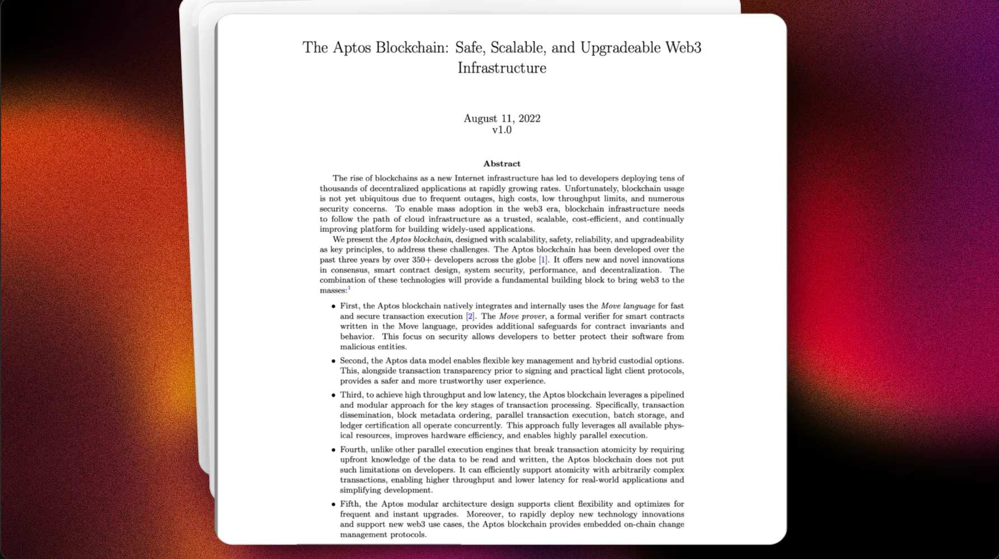
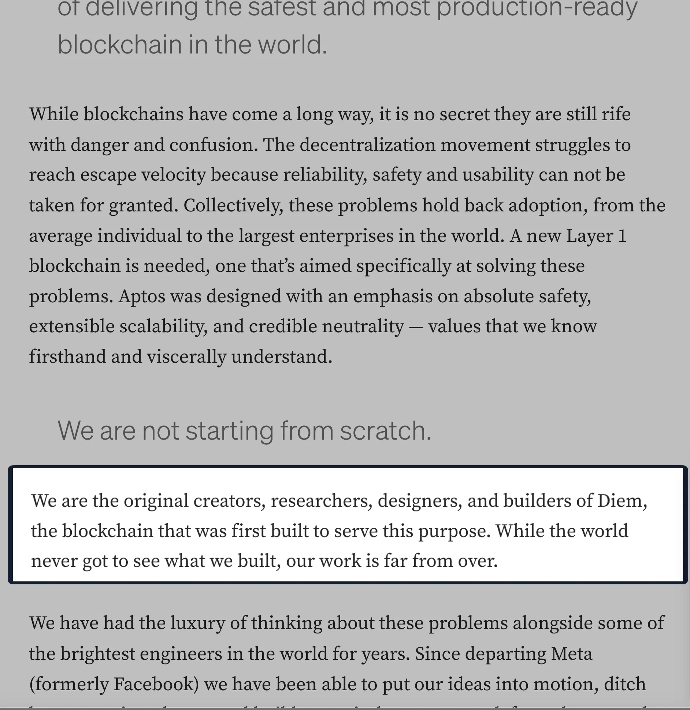

> “The people” that's what Aptos means…  Aptos was designed as the blockchain for the people / for everyone." 

## The people - Aptos blockchain 

Nếu Aptos được gọi là blockchain cho mọi người, vậy điều gì làm cho nó trở nên đặc biệt như vậy? Web3 chẳng phải ban đầu được thiết kế để trao quyền lại cho người dùng, giải phóng họ khỏi  control bởi của các tập đoàn công nghệ lớn như Facebook và Google hay sao?

Mặc dù đó là mục tiêu ban đầu, nhưng các blockchain vẫn chưa đạt được điều này. Chỉ cần nhìn vào phí gas  Ethereum, ta có thể thấy người dùng phổ thông đã bị "price out" khỏi hệ sinh thái mà đáng lẽ phải phục vụ họ.

## The people behind Aptos 

Hai nhà sáng lập Avery Ching và Mo Shaikh đã nhận ra một thực tế đáng buồn về blockchain hiện nay:

> "Unfortunately, blockchain usage is not yet ubiquitous due to frequent outages, high costs, low throughput limits, and numerous security concerns."
> 

Họ mong muốn quay trở lại tầm nhìn ban đầu của Web3 và blockchain. Nhưng họ cũng nhận ra cần một hướng đi mới: "Để blockchain được ứng dụng rộng rãi trong internet, infrastructure của blockchain cần đi theo hướng của cloud infrastructure - một nền tảng đáng tin cậy, có khả năng scale, hiệu quả về chi phí và liên tục được cải tiến để xây dựng các ứng dụng phổ biến."

Từ tầm nhìn đó, blockchain Aptos đã ra đời với bản [whitepaper](https://aptosfoundation.org/whitepaper) mang tính đột phá, hứa hẹn giải quyết những thách thức cốt lõi mà blockchain đang phải đối mặt.

## Mo và Avary là ai? 

Cả 2 đã từng làm việc ở dự án Facebook’s blockchain ( Novi/ libra/ Diem) cùng thời điểm. Bạn có thể thấy tên của ông Avery Ching ở paper libra blockchain. Hay trong chính bài viết của Mo ở [Medium](https://medium.com/aptoslabs/the-genesis-of-aptos-ff98d86e9445):

Các founders của Aptos có tầm nhìn riêng biệt về blockchain của họ. Mặc dù Aptos và Sui có chung nguồn gốc từ Diem, hai blockchain này có những điểm khác biệt rõ rệt, chủ yếu đến từ cách họ thực thi tầm nhìn của mình. Như bạn có thể thấy từ tên gọi của Aptos, đây là một blockchain dành cho mọi use case. Khác với những blockchain tự gọi mình là "blockchain cho DeFi" hay "blockchain cho gaming", Aptos - blockchain cho mọi người - cho phép bất kỳ ai cũng có thể build ứng dụng trên nền tảng của họ. Aptos tập trung vào các mẳng lớn bao gồm AI, Gaming, NFTs, Social media, Entertainment hay Defi.

