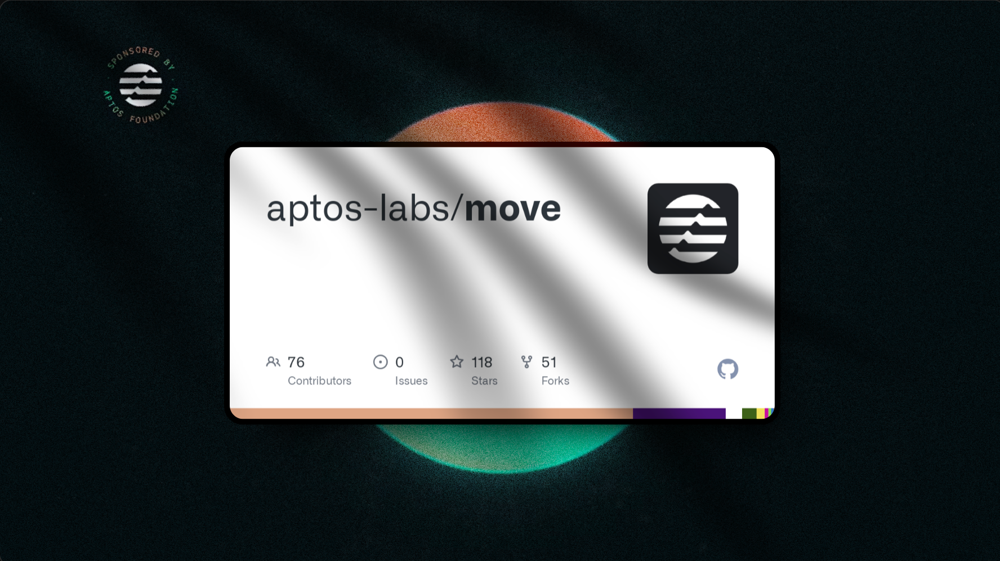
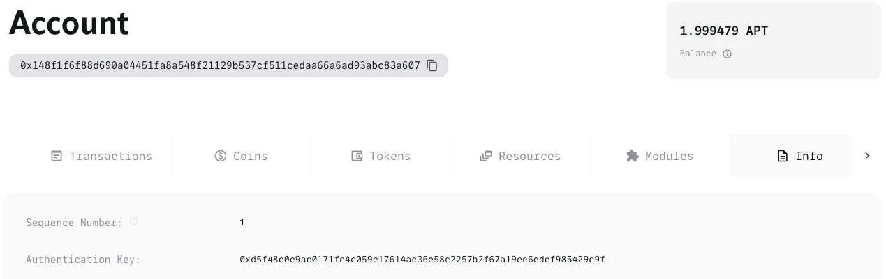
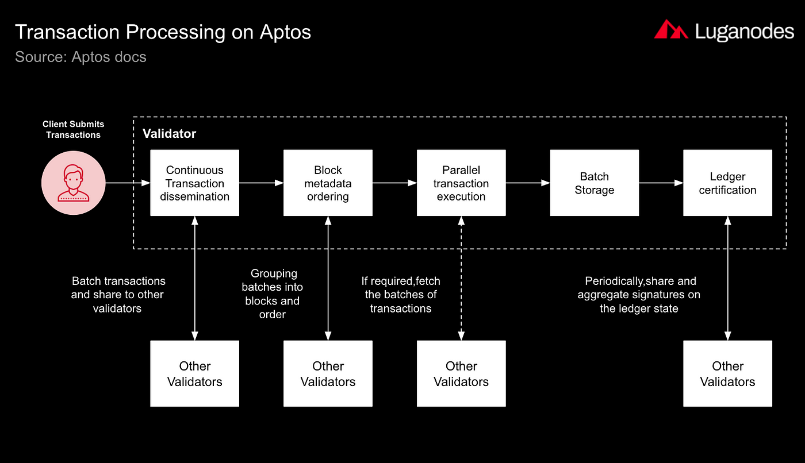

## Aptos - three pillars ( 3 nguyên tắc cốt lõi  ) 

Aptos có 3 core designs principles/ innovations: 
- A new language that's easy to audit and analyse
- A data model that enables flexible key management and hybrid custody
- A modular approach for extremely high throughput and low latency

## Pillar 1: A new language

The new language ở đây chính là Move mà mình đã nhắc đến trong bài trên được phát triển bởi team Meta's Libra/ Diem project. Mục đích của ngôn ngữa này là để counter các problems mà solidity khi viết smảt contract. Mục tiêu chính là được thiết kế cho sự an toàn. Trong Aptos whitepaper đã explain:

> The aptos blockchain uses Move’s object model to represent its ledger state and uses move code ( modules ) to encode rules of state transitions 

Như chúng ta sẽ thấy sau này, Move và Aptos kết hợp với nhau rất tốt, tạo ra nhiều tính năng hữu ích. Hãy xem một ví dụ dễ hiểu.

Bạn biết vụ hack DAO không? Đó là khi hacker lợi dụng lỗi double spend (chi tiêu hai lần) trong Solidity. Lỗi này rất khó phát hiện trong Solidity. Nhưng với Move, mọi thứ được kiểm soát chặt chẽ hơn. Move có các module quản lý chặt chẽ cách tài nguyên được tạo ra, lưu trữ và sử dụng.

Theo Aptos Whitepaper, điều này giúp bảo vệ các tài sản như tiền điện tử. Không ai có thể tạo tiền giả, chi tiêu một đồng tiền hai lần, hay làm mất tiền một cách bí ẩn. Điều quan trọng nhất về Move là: an toàn là ưu tiên số một.

## Pillar 2: A logical data model / Transparency /  New custody

Trong Aptos, trạng thái của sổ cái (ledger) chính là state của tất cả các tài khoản. Có rất nhiều cơ chế phức tạp đang hoạt động bên dưới mô hình dữ liệu này, và trụ cột này có mối liên hệ chặt chẽ với ngôn ngữ Move. Bỏ qua những thuật ngữ kỹ thuật phức tạp, điều thú vị là khả năng bảo mật cao mà nó mang lại cho người dùng cuối. 

Như chúng ta đã thấy từ lý do tại sao Move được tạo ra, vấn đề dai dẳng với các blockchain chính là các vụ hack. Move giải quyết các vụ hack liên quan đến smart contract, nhưng một nguồn hack lớn lại đến từ chính người dùng.

Một ví dụ điển hình là khi người dùng tưởng rằng họ chỉ đang kết nối ví với một dApp, nhưng thực tế họ vừa ký một giao dịch rút sạch ví của họ (chuyển toàn bộ token cho hacker). Aptos giải quyết vấn đề này bằng cơ chế gọi là **pre-transaction execution** (thực thi trước giao dịch). Nói cách khác, nó cho người dùng thấy kết quả của hành động trước khi họ thực sự thực hiện nó.

Mô hình tài khoản và dữ liệu linh hoạt của Aptos (hỗ trợ cả tính năng xoay khóa - key rotation) giúp giải quyết vấn đề nan giải từ lâu về việc lựa chọn giữa tự quản lý private key hoặc ủy thác cho bên thứ 3. 

Với Aptos, chúng ta có thể ủy quyền cho một bên khác (ví dụ như **custodian**) khả năng rotate private key của chúng ta. Ví dụ như khi chúng ta là một trader tích cực và muốn cho sàn giao dịch quyền truy cập dễ dàng vào quỹ để giao dịch, nhưng sang năm sau thì không còn giao dịch nữa.

Với Aptos, chúng ta có thể cấp quyền truy cập **private key cho sàn giao dịch trong năm nay**, và đơn giản là xoay khóa để thu hồi quyền kiểm soát vào năm sau. Tất cả điều này diễn ra mà không cần phải chuyển tiền giữa các ví, giúp bảo vệ an toàn cho tài sản của chúng ta.

Bạn có thể đọc thêm ở đây: https://noncegeek.medium.com/aptos-key-rotation-learning-move-0x02-809053f29aff

## Pillar 3 Transaction processing 

**Aptos có tốc độ nhanh nhờ ba yếu tố chính:**

1. Xử lý giao dịch theo nhóm: Thay vì xử lý từng giao dịch một, Aptos gom nhiều giao dịch thành một nhóm để xử lý cùng lúc. Giống như việc gửi nhiều món hàng trong một container sẽ hiệu quả hơn gửi từng món riêng lẻ. Tuy phải đợi gom đủ giao dịch nhưng cách này nhanh hơn nhiều.
2. Cách xử lý giao dịch thông minh: Aptos tách riêng hai quá trình - xác nhận giao dịch và phân phối giao dịch. Nhờ vậy, hệ thống có thể xử lý được hàng trăm nghìn giao dịch mỗi giây.
3. Xử lý song song: Aptos có thể thực hiện nhiều giao dịch cùng một lúc nếu chúng không ảnh hưởng đến nhau. Giống như trong cửa hàng, hai người có thể mua hai món hàng khác nhau cùng lúc. Nhưng nếu họ muốn mua cùng một món, hệ thống sẽ xử lý lần lượt.

Khi đã biết những giao dịch cần ghi vào blockchain, Aptos có thể ghi tất cả cùng một lúc thay vì từng cái một. Giống như một con tàu lớn có thể dỡ nhiều hàng cùng lúc sẽ hiệu quả hơn nhiều tàu nhỏ dỡ hàng riêng lẻ.

Tuy cách hoạt động của Aptos nghe có vẻ phức tạp, nhưng tin vui là dev  không cần phải lo lắng về điều này. Ngay cả khi bạn chưa hiểu hết những điều trên, bạn vẫn có thể trở thành một dev Aptos giỏi. Tất cả các cơ chế xử lý đều được Move và blockchain Aptos tự động xử lý. Chúng ta chỉ cần biết rằng nhờ những cải tiến này mà Aptos có tốc độ xử lý nhanh hơn nhiều so với các blockchain khác.

> All this means that with Aptos, we can think outside the box. 