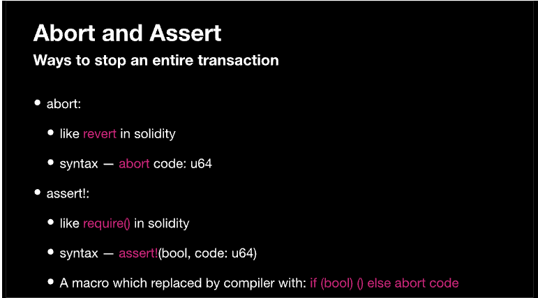

# Abort và Assert 


Bạn có thể Throw error qua việc dùng `assert` hoặc `abort`


## Vậy Abort là gì ? 




Cơ chế Abort trong Move là một tính năng quan trọng cho phép dừng thực thi an toàn và hoàn tác các thay đổi trạng thái. Dưới đây là một số điểm chính:

* Explicit Trigger: Abort có thể được kích hoạt một cách rõ ràng bằng lệnh abort. Lệnh này nhận một mã lỗi làm tham số.
* Runtime Errors: Một số lỗi runtime như truy cập ngoài phạm vi mảng cũng có thể kích hoạt abort. Những lỗi này xảy ra tự động trong quá trình thực thi.
* State Reversion:  Khi abort xảy ra, mọi thay đổi đối với trạng thái global đều được hoàn tác. Điều này đảm bảo giao dịch thất bại và trạng thái vẫn nhất quán. 
* Error Code:  Mã lỗi được cung cấp trong lệnh abort sẽ được chuyển đến client hoặc caller dưới dạng lỗi giao dịch. Điều này cho phép xử lý lỗi chi tiết hơn.

Ví dụ về Abort: 
```rust
fun div (num1: u64, num2: u64){
    if (num1 == 0 || num2 == 0)
    abort 0 ;
    let divide = a/b;
   
}
```

Trong ví dụ này

- Hàm `div` nhận hai tham số đầu vào `num1` và `num2` có kiểu dữ liệu `u64`.
- Nó kiểm tra xem có tham số nào bằng 0 không, nếu có thì sẽ dừng thực thi (abort) với mã lỗi 0.
- Nếu không có abort, nó sẽ tiếp tục thực thi dòng lệnh tiếp theo và thực hiện phép chia.


Bài tập: Hãy tạo một function tên `add_participant` nhận một tham số b là tham chiếu có thể thay đổi (mutable reference) đến struct Bootcamp. Trong phần thân function, viết code kiểm tra điều kiện: nếu total_participants = 50 thì sẽ abort với mã lỗi 0 (vì đã đạt giới hạn số lượng học viên), ngược lại sẽ tăng total_participants lên 1.


## Thế Assert là gì ?

Assert trong Move là một cách để kiểm tra điều kiện và dừng thực thi nếu điều kiện đó không thỏa mãn. Dưới đây là một số điểm chính về việc sử dụng assert:

- **Kiểm tra điều kiện Boolean:** Assert sẽ check một điều kiện boolean, và nếu kết quả là false thì sẽ trigger abort.
- **Hoàn tác trạng thái:** Khác với abort thông thường, khi abort bởi assert sẽ không hoàn tác các thay đổi trạng thái. Lỗi giao dịch vẫn được thông báo như bình thường.
- **Phát hiện lỗi:** Assert đóng vai trò quan trọng trong việc bắt lỗi và debug trong quá trình test và phát triển. Nó giúp đảm bảo chương trình tuân thủ các điều kiện mong muốn.

Syntax của Assert!: 
```rust 
assert!(<bool expression>, <code>)
```

Ví dụ như: 
```rust
fun div (num1: u64, num2: u64) {
	assert!((num1 == 0 || num2 == 0),0)
	let _divide: u64 = a/b;
}
```

Trong ví dụ này:

- Hàm `div` nhận hai tham số đầu vào `num1` và `num2` có kiểu dữ liệu `u64`.
- Hàm sẽ check xem có input nào bằng 0 không, nếu có thì sẽ abort với error code 0.
- Nếu không abort thì sẽ thực thi dòng lệnh tiếp theo và thực hiện phép chia.
- Lưu ý đây là ví dụ tương tự như phần trước khi giải thích về `abort`. Điểm khác biệt chính là thay vì dùng câu lệnh `if` thì điều kiện được viết trực tiếp bằng statement `assert!`.

