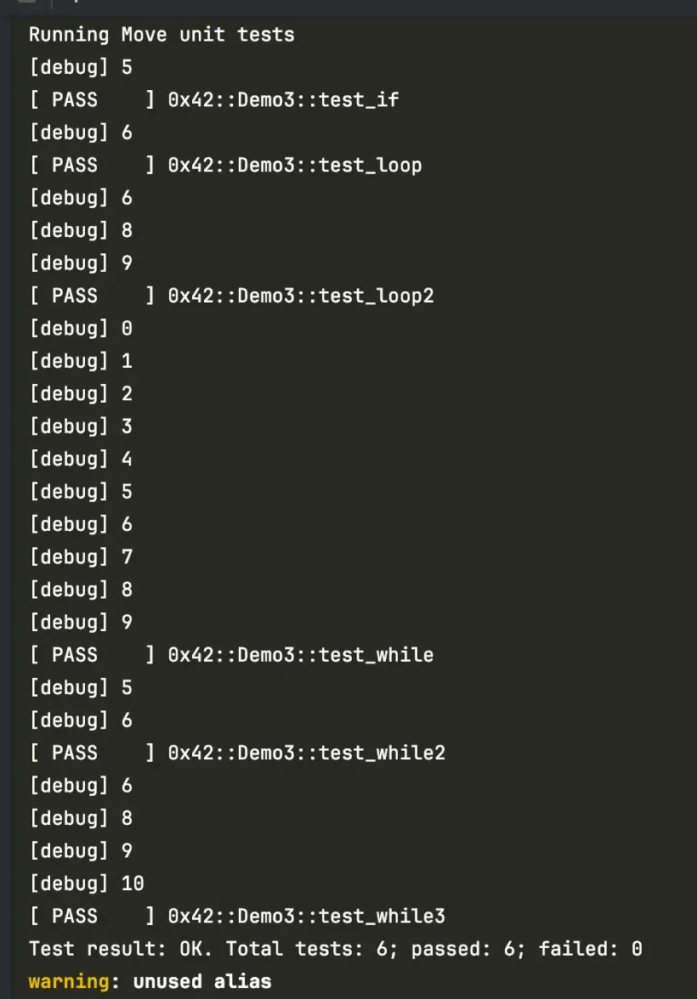

# Giới thiệu về Control flow trong Aptos 

**Control Flow** là cách điều khiển chương trình thực hiện các lệnh theo thứ tự nhất định, dựa trên các điều kiện khác nhau. Trong Aptos Move, chúng ta có thể sử dụng ba công cụ chính:

- Câu lệnh`if`để kiểm tra điều kiện
- Vòng lặp`while`để lặp lại code khi điều kiện đúng
- Vòng lặp`loop`để lặp vô hạn

Khi viết smart contract bằng Move, những công cụ này giúp chúng ta xây dựng logic phức tạp một cách dễ dàng hơn. Chúng ta cũng có thể dùng`break`và`continue`để kiểm soát cách vòng lặp hoạt động tốt hơn.

## if Conditional Statements

Câu lệnh if là cách đơn giản nhất để kiểm soát chương trình. Nó cho phép code chạy theo các hướng khác nhau dựa trên điều kiện. 

Ví dụ, khi kiểm tra giá trị của biến x, chương trình sẽ thực hiện những việc khác nhau tùy thuộc vào giá trị đó:

```rust 
module 0x42::Demo3 {
    use std::debug;


    #[test]
    fun test_if() {
        let x = 5;
        let x2 = 10;
        
        if (x == 5) {
            debug::print(&x);
        } else {
            debug::print(&x2);
        }
    }
}
```

Trong ví dụ này, nếu biến `x` bằng 5, giá trị của `x` sẽ được in ra; ngược lại, giá trị của biến `x2` sẽ được in ra. 

Cách kiểm tra điều kiện này thường được sử dụng trong smart contract thực tế để xử lý các thao tác được kích hoạt bởi các điều kiện khác nhau, ví dụ như kiểm tra số dư tài khoản có đủ hay không, xác thực quyền của người dùng, v.v.


## While Loop 

Vòng lặp `while` cho phép một khối code được thực thi lặp đi lặp lại khi một điều kiện được thỏa mãn. 

Khi điều kiện không còn đúng nữa, vòng lặp sẽ kết thúc. Trong Move, vòng lặp `while` rất linh hoạt và có thể xử lý các kịch bản như thao tác hàng loạt và kiểm tra sự kiện. Dưới đây là một ví dụ cơ bản về vòng lặp `while`:

```rust
#[test]
fun test_while() {
    let x = 0;
    while (x < 10) {
        debug::print(&x);
        x = x + 1;
    }
}
```

Trong ví dụ này, biến `x` bắt đầu từ 0 và tăng lên 1 đơn vị mỗi lần lặp cho đến khi `x` không còn nhỏ hơn 10 nữa thì dừng lại. 

Trong smart contract, vòng lặp `while` tương tự có thể được sử dụng để xử lý các tác vụ hàng loạt như chuyển token theo batch, xác thực giao dịch theo batch và các kịch bản khác.

## Sử dụng break để thoát vòng lặp sớm 

Vòng lặp while có thể được kết thúc sớm bằng cách sử dụng câu lệnh break khi một điều kiện nào đó được thỏa mãn. Dưới đây là ví dụ minh họa cách sử dụng câu lệnh break:

```rust 
#[test]
fun test_while2() {
    let x = 5;
    while (x < 10) {
        debug::print(&x);
        x = x + 1;

        if (x == 7) {
            break;
        }
    }
}
```

Trong đoạn code này, khi biến `x` bằng 7, câu lệnh `break` sẽ dừng vòng lặp lại, tránh việc thực thi các bước tiếp theo không cần thiết. 

Câu lệnh `break` thường được dùng để tối ưu hóa việc thực thi hợp đồng và giảm thiểu các phép tính hoặc thao tác không cần thiết.


## Sử dụng continue để bỏ qua vòng lặp hiện tại

Đôi khi chúng ta cần bỏ qua một số thao tác trong vòng lặp mà không cần phải kết thúc hoàn toàn vòng lặp đó. Trong trường hợp này, chúng ta có thể sử dụng câu lệnh continue:

```rust 
#[test]
fun test_while3() {
    let x = 5;
    while (x < 10) {
        x = x + 1;
        if (x == 7) {
            continue;
        };
        debug::print(&x);
    }
}
```

Trong ví dụ này, khi biến x bằng 7, câu lệnh continue sẽ bỏ qua các lệnh còn lại trong vòng lặp hiện tại và tiếp tục với vòng lặp kế tiếp.

Cách sử dụng này giúp lọc bỏ các thao tác không cần thiết và tối ưu hiệu suất của code.

## Loop inf 

loop là một vòng lặp vô hạn sẽ tiếp tục chạy cho đến khi được thoát ra bằng câu lệnh break. Nó thường được sử dụng cho các tác vụ cần chạy liên tục, ví dụ như chờ đợi một điều kiện bên ngoài thay đổi. Dưới đây là cấu trúc cơ bản của vòng lặp loop:

```rust 
#[test]
fun test_loop() {
    let x = 5;
    loop {
        x = x + 1;
        if (x == 7) {
            break;
        };
        debug::print(&x);
    }
}
```

Trong ví dụ này, vòng lặp sẽ tiếp tục thực thi cho đến khi biến x bằng 7, sau đó vòng lặp sẽ thoát ra bằng câu lệnh break. Vòng lặp loop thường được sử dụng trong các tình huống như theo dõi sự kiện liên tục, kiểm tra tài nguyên bên ngoài, v.v.

## Các câu lệnh điều khiển vòng lặp: loop, continue và break

Chúng ta có thể kết hợp các câu lệnh loop, continue và break trong một vòng lặp như ví dụ dưới đây:

```rust 
#[test]
fun test_loop2() {
    let x = 5;
    loop {
        x = x + 1;
        if (x == 7) {
            continue;
        };
        if (x == 10) {
            break;
        };
        debug::print(&x);
    }
}
```

Đoạn code này cho thấy một vòng lặp loop phức tạp hơn, sử dụng continue để bỏ qua một số điều kiện và kết thúc vòng lặp ở một điều kiện khác. Việc kết hợp các câu lệnh break và continue cho phép dev có nhiều sự linh hoạt hơn trong việc điều khiển luồng của vòng lặp.

## While, For và Loop cases 

Như vậy bạn đã biết Move cung cấp ba cấu trúc để tạo vòng lặp: vòng lặp while, vòng lặp for, và vòng lặp loop.

```rust 
module 0x42::Demo3 {
    use std::debug;

    #[test]
    fun test_if() {
        let x = 5;
        let x2 = 10;
        if (x == 5) {
            debug::print(&x);
        } else {
            debug::print(&x2);
        }
    }

    #[test]
    fun test_while() {
        let x = 0;
        while (x < 10) {
            debug::print(&x);
            x = x + 1;
        }
    }

    #[test]
    fun test_while2() {
        let x = 5;
        while (x < 10) {
            debug::print(&x);
            x = x + 1;

            if (x == 7) {
                break;
            }
        }
    }

    #[test]
    fun test_while3() {
        let x = 5;
        while (x < 10) {
            x = x + 1;
            if (x == 7) {
                continue;
            };
            debug::print(&x);
        }
    }

    #[test]
    fun test_loop() {
        let x = 5;
        loop {
            x = x + 1;
            if (x == 7) {
                break;
            };
            debug::print(&x);
        }
    }

    #[test]
    fun test_loop2() {
        let x = 5;
        loop {
            x = x + 1;
            if (x == 7) {
                continue;
            };
            if (x == 10) {
                break;
            };
            debug::print(&x);
        }
    }
}
```

Tất cả các test trong code có thể chạy trực tiếp trong Move. Các annotation #[test] giúp việc thực thi từng function và xem kết quả một cách dễ dàng. Dưới đây là output  khi chạy các test:




