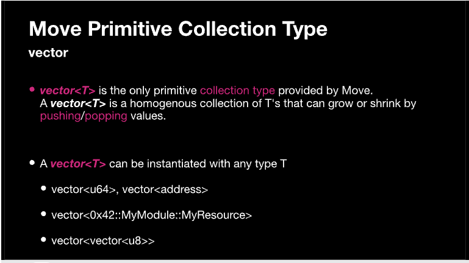

Trước khi bắt đầu 


## **Unsigned integers: u8, u32, u64, u128, u256**

Tất cả các số nguyên trong Move đều là *unsigned* (không dấu). Điều này có nghĩa là bạn không thể gán giá trị âm (nhỏ hơn 0). 

Move hỗ trợ các kiểu số nguyên với kích thước khác nhau: `u8`, `u16`, `u32`, `u64`, `u128`, và `u256`. Bạn có thể khai báo kiểu như sau:

```
let explicit_u8 = 1u8;

let annotated_u8: u8 = 1;
```

Ví dụ, u8 có thể lưu trữ giá trị tối đa là 255, trong khi u256 có thể lưu trữ giá trị lên đến 2^256 - 1. Kiểu số nguyên được sử dụng phổ biến nhất là u64. Các kiểu nhỏ hơn như u8 và u32 thường chỉ được dùng để tiết kiệm gas (sử dụng ít dung lượng lưu trữ hơn). Các kiểu lớn hơn như u128 và u256 chỉ được sử dụng khi cần lưu trữ những số rất lớn.

Integer examples: 
```rust
script {
    use std::debug;

    fun integers() {
        let num: u8 = 10;
        let num2: u64 = 103;
        let num3 = 10; // default u64
        let num4 = 10u128;
        let two_exp_64 = 1u128 << 64;

        let cast = (two_exp_64 as u64); // overflow
        debug::print(&cast);
    }
}
```


```rust
//Integers: u8,u64,u128
    let a:u8=10;
    let b:u64=1000;
    let c:u128=10000;
    print(&a); print(&b); print(&c);
```


## Bool 


Bool chỉ đơn giản là true hoặc false. Bạn có thể sử dụng các toán tử tiêu chuẩn &&, ||, và ! cho các phép toán "và", "hoặc", và "phủ định".
```rust
#[test]
fun test_bool() {
    let bool_true: bool = true;
    let bool_false: bool = false;
    print(&bool_true);
    print(&bool_false);
    print(&(bool_true == bool_false)); // prints comparison result
}
```

Nếu bạn thắc mắc là dùng print thế nào thì trong Aptos Move, việc debug được thực hiện thông qua thư viện std::debug, cần được import ở đầu module bằng câu lệnh use std::debug;. Thư viện này có chức năng tương tự như console.log() trong TypeScript hoặc hardhat/console.sol trong Solidity trên blockchain EVM:

```rust
    use std::debug::print;
```


## String 

Move không có sẵn kiểu dữ liệu chuỗi (string). Để làm việc với chuỗi trong Aptos, bạn có hai cách:

1. Dùng module string bằng lệnh `use std::string::{String}`
2. Dùng `vector<u8>`để lưu trữ chuỗi dưới dạng các byte

Chúng ta sẽ học cả hai cách này trong bài viết. Đây là cách hiển thị và in giá trị trong Move thông qua hàm VM native:

`aptos_std::debug::print` sẽ chuyển đổi (serialize) và hiển thị giá trị Move ra console. Khi muốn in chuỗi byte để hiển thị ra console, ta cần chuyển đổi chuỗi byte `b"my string"` sang định dạng có thể đọc được bằng cách mã hóa `utf8`.

```rust 
module my_address::StringsDemo{
    use std::debug;
    use std::string::{String, utf8};
    
    fun my_message():String {
        let msg: String = utf8(b"This is the String I want to print to the screen.");
        return msg
    }


    #[test]
    fun testing(){
        let msg = my_message();
        debug::print(&msg);
    } 
}
```

Ngoài ra, bạn có thể in chuỗi mà không cần sử dụng string::String bằng cách lưu trữ chuỗi dưới dạng vector số nguyên không dấu:

```rust
    #[test]
    fun print_test_message(){
        let msg:vector<u8> = b"This is my test message."; ;
        debug::print(&msg); // prints the byte string
        debug::print(&utf8(msg)); // prints the human readable string
    } 

```


## Address 
Address là định danh 256-bit trong bộ nhớ global. Mỗi Object và tài khoản đều có một address dùng để tham chiếu tới nó.

Một số address quan trọng được gọi là "named addresses" (ví dụ: "0x1" là một named address chứa nhiều hàm cơ bản được deploy trên đó). Named addresses phải được tham chiếu bằng tên đơn giản của chúng.

Khi sử dụng address trong biểu thức (ở bên phải dấu `=`), cần thêm tiền tố `@` để phân biệt với số nguyên.


```rust
#[test]
fun test_addr() {
    let addr: address = @0x42;
    let addr_2: address = @0x00000000000000000000000000000000000000000A;
    print(&addr);
    print(&addr_2);

```


Địa chỉ (address) có hai giới hạn quan trọng khi chạy:

1. Khi sử dụng biến chứa địa chỉ, bạn chỉ có thể dùng địa chỉ đó để truy cập tài nguyên (resources) chứ KHÔNG thể truy cập module. (Ví dụ: không cho phép cú pháp `variable_address::function`)
2. Bạn không thể tạo động một địa chỉ từ số nguyên. (Ví dụ: `1u256` không tương đương với `0x1`)


Address example: 

```rust
script { 
    use Std::Debug;

    fun addresses (alice: address){ 

    Debug::print(&alice);
    let bob = @Oxcafe;
    
    Debug::print (&bob);
    
    
    let num = Oxcafe;
    Debug::print(&num) ;
    // alice::Debug::print(&bob): // dynamic dispatch not allowed!

    }

}
```


## Signer 

`signer` là một kiểu dữ liệu đại diện cho kiểm soát tài nguyên hoặc tài sản trên blockchain. Kiểu signer được sử dụng để chỉ ra tài khoản hoặc thực thể nào chịu trách nhiệm thực thi một giao dịch hoặc thao tác cụ thể trên blockchain.

Đây là native implementation:

```rust
struct signer has drop { a: address }

```

Giá trị signer rất đặc biệt vì chúng không thể được tạo thông qua literals hoặc instructions - chỉ có thể được tạo bởi Move VM. Trước khi VM chạy một script có tham số kiểu `signer`, nó sẽ tự động tạo các giá trị `signer` và truyền vào script:

### signer operations

Module `std::signer` trong thư viện chuẩn cung cấp hai hàm tiện ích để làm việc với giá trị `signer`:

- `signer::address_of(&signer): address` - Trả về địa chỉ `address` được bọc bởi `&signer` này.
- `signer::borrow_address(&signer): &address` - Trả về tham chiếu đến địa chỉ `address` được bọc bởi `&signer` này.


```rust
module my_addrx::MyResource
{
    use std::signer; 
    
    struct MyResource has key
    {
        value:u64
    }

    public entry fun increase_value_by_one(account: &signer) acquires MyResource {
        
        let signer_address = signer::address_of(account); 
        
        let myresource = borrow_global_mut<MyResource>(signer_address);
        myresource.value=myresource.value+1;
    }
}
```

## Reference 
References (Tham chiếu) cho phép bạn lấy con trỏ đến dữ liệu. Move có hai loại tham chiếu:

- Tham chiếu bất biến (`&`): chỉ cho phép đọc và không thể sửa đổi giá trị gốc hoặc bất kỳ trường nào của nó
- Tham chiếu có thể thay đổi (`&mut`): cho phép sửa đổi thông qua việc ghi qua tham chiếu đó

Bạn có thể giải tham chiếu bằng toán tử `*` để lấy giá trị được gắn với tham chiếu. Đối với tham chiếu có thể thay đổi, bạn có thể dùng cách này để cập nhật giá trị gốc.

```rust
module example::0x1 {

  // Example of using &mut to update

  fun mut_example() {

      let mut a = 3;

      let a_mut_ref = &mut a;

      *a = 4; // Only possible for values which can be changed

      let value_of_a = *a;

  }

}
```

Một hạn chế của references là bạn không thể lưu trữ chúng trong structs. References chỉ tồn tại tạm thời vì chúng không thể được serialize để lưu trữ vĩnh viễn.

## Vector 



Vector là kiểu collection (tập hợp) duy nhất được cung cấp trong Move. Bạn có thể khởi tạo một chuỗi bytes bằng cú pháp `b"..."`. Ví dụ: `b"Hello!\n"`.

`vector` có nhiều hàm quen thuộc để thao tác với vector như các ngôn ngữ khác. Ví dụ:


## Tuples 

Tuples trong Move là chuỗi phần tử có thứ tự và không thể thay đổi. Chúng được khai báo bằng cú pháp dấu ngoặc đơn, ví dụ như `(x: u64, y: address)`. Tuples nhóm các giá trị có thể khác kiểu dữ liệu lại với nhau, với các kiểu được chỉ định sau dấu hai chấm.

Các điểm chính về tuples:

- Tuples có độ dài cố định và không thể thay đổi sau khi tạo.
- Để truy cập phần tử của tuple, bạn dùng ký hiệu chấm như `my_tuple.0` hoặc `my_tuple.y`.
- Tuples thường được dùng để trả về nhiều giá trị từ các hàm hoặc phương thức của struct.

Ví dụ

```rust
fun return_two_values(): (u64, address) {
  let x = 10;
  let y = 0xabc123;
  (x, y)
}

let (a, b) = return_two_values();

```

Tuples cũng có thể được phân rã thông qua pattern matching để trích xuất các giá trị phần tử:

```rust
let my_tuple = (10, 0xabc123);
let (x, y) = my_tuple;
```

Lưu ý rằng tuples là immutable (không thể thay đổi), nghĩa là giá trị các phần tử không thể sửa đổi sau khi khởi tạo. Nếu cần giá trị khác, bạn phải tạo tuple mới.

Tóm lại, tuples trong Move là chuỗi các kiểu dữ liệu khác nhau có thứ tự và không thể thay đổi. Chúng thường được dùng để trả về nhiều giá trị từ các hàm.