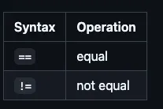

# Operations on Aptos 


## Arthmetic


Mỗi kiểu dữ liệu này đều hỗ trợ cùng một tập hợp các phép toán số học được kiểm tra. Đối với tất cả các phép toán này, cả hai toán hạng (bên trái và bên phải) bắt buộc phải cùng kiểu dữ liệu. Nếu bạn cần thực hiện phép tính với các giá trị khác kiểu dữ liệu, bạn sẽ cần thực hiện ép kiểu trước. Tương tự, nếu bạn dự đoán kết quả của phép toán sẽ quá lớn so với kiểu số nguyên hiện tại, hãy ép kiểu lên một kích thước lớn hơn trước khi thực hiện phép toán.

Tất cả các phép toán số học sẽ dừng lại thay vì hoạt động theo cách mà số nguyên trong toán học không thể thực hiện được (ví dụ: tràn số, tràn số âm, chia cho 0).


```rust
module my_addrx::Operations
{
    use std::debug::print;

    fun arthmetic_operations(a:u64,b:u64)
    {
        let ans=a+b;       print(&ans);
        let ans=a-b;       print(&ans);
        let ans=a*b;       print(&ans); 
        let ans=a/b;       print(&ans);
        let ans=a%b;       print(&ans);
    }
    #[test]
    fun testing()
    {
        arthmetic_operations(10,3);
    }
}
```


## Bitwise


Các kiểu số nguyên hỗ trợ các phép toán bitwise sau đây, xử lý mỗi số như một chuỗi các bit riêng lẻ (0 hoặc 1) thay vì giá trị số nguyên. Các phép toán bitwise không gây ra lỗi runtime.

```rust
module my_addrx::Operations
{
    use std::debug::print;

    fun bitwise_operations(a:u64,b:u64)
    {
        let ans=a|b;       print(&ans);
        let ans=a&b;       print(&ans);
        let ans=a^b;       print(&ans);  

    }

    #[test]
    fun testing()
    {
        bitwise_operations(1,0);
    }
}
```


## Bitshift


Tương tự như các phép toán bitwise, mỗi kiểu số nguyên đều hỗ trợ phép dịch bit. Tuy nhiên, khác với các phép toán khác, toán hạng bên phải (số bit cần dịch) phải *luôn luôn* là kiểu `u8` và không cần phải cùng kiểu với toán hạng bên trái (số cần dịch bit).

Phép dịch bit có thể bị dừng đột ngột nếu số bit cần dịch lớn hơn hoặc bằng `8`, `16`, `32`, `64`, `128` hoặc `256` tương ứng với các kiểu dữ liệu `u8`, `u16`, `u32`, `u64`, `u128` và `u256`.

```rust
module my_addrx::Operations
{
    use std::debug::print;

    fun bitshift_operations(a:u64)
    {
        let ans=a>>2;       print(&ans);
        let ans=a<<2;       print(&ans);

    }

    #[test]
    fun testing()
    {
        bitshift_operations(4);
    }
}
```

## Comparision


Các kiểu số nguyên là *loại dữ liệu duy nhất* trong Move có thể sử dụng các toán tử so sánh. Cả hai toán hạng phải cùng kiểu dữ liệu. Nếu bạn cần so sánh các số nguyên có kiểu khác nhau, bạn sẽ cần ép kiểu một trong số chúng trước.

Các phép toán so sánh không gây ra lỗi runtime.

```rust
module my_addrx::Operations
{
    use std::debug::print;

    fun comparison_operations(a:u64,b:u64)
    {
        let ans=a < b;        print(&ans); //always give proper spacing between comparison operator and the operands
        let ans=a > b;        print(&ans);
        let ans=a <= b;       print(&ans);  
        let ans=a >= b;       print(&ans);  

    }

    #[test]
    fun testing()
    {
        comparison_operations(10,14);
    }
}
```


## Equality

Giống như tất cả các kiểu dữ liệu có thuộc tính drop trong Move, các kiểu số nguyên đều hỗ trợ các phép toán "bằng" và "không bằng". Cả hai toán hạng phải cùng kiểu dữ liệu. Nếu bạn cần so sánh các số nguyên có kiểu khác nhau, bạn sẽ cần ép kiểu (cast) một trong số chúng trước. Các phép toán so sánh bằng không gây ra lỗi runtime (không dừng chương trình đột ngột).



```rust
module my_addrx::Operations
{
    use std::debug::print;

    fun comparison_operations(a:u64,b:u64)
    {
        let ans=a == b;        print(&ans);
        let ans=a != b;        print(&ans);
    }

    #[test]
    fun testing()
    {
        comparison_operations(10,14);
    }
}
```

## Casting


```rust
Các kiểu số nguyên có thể được chuyển đổi từ kích thước này sang kích thước khác. Số nguyên là kiểu dữ liệu duy nhất trong Move hỗ trợ việc ép kiểu này.

Việc ép kiểu sẽ *không* cắt bớt giá trị. Thay vào đó, nó sẽ dừng chương trình nếu kết quả quá lớn so với kiểu dữ liệu đích
```

Ở đây, kiểu của `e` phải là `8`, `16`, `32`, `64`, `128` hoặc `256` và `T` phải là `u8`, `u16`, `u32`, `u64`, `u128` hoặc `u256`.

Ví dụ:

- `(x as u8)`
- `(y as u16)`
- `(873u16 as u32)`
- `(2u8 as u64)`
- `(1 + 3 as u128)`
- `(4/2 + 12345 as u256)`

Ví dụ: chúng ta đã thấy các kiểu số nguyên khác nhau: u8, u32, u64, u128, u256. Mặc dù việc tính toán giữa các số nguyên cùng kiểu dữ liệu rất đơn giản, nhưng không thể thực hiện phép tính trực tiếp giữa các số nguyên khác kiểu dữ liệu:

```rust
fun mixed_types_math(): u64 {
    let x: u8 = 1;
    let y: u64 = 2;
    // This will fail to compile as x and y are different types. One is u8, the other is u64.
    x + y
}
```

Để sửa lỗi này, chúng ta cần ép kiểu x thành u64 bằng cách sử dụng (x as u64). Lưu ý rằng dấu ngoặc đơn () là bắt buộc khi thực hiện ép kiểu.

```rust
fun mixed_types_math(): u64 {
    let x: u8 = 1;
    let y: u64 = 2;

    (x as u64) + y
}
```