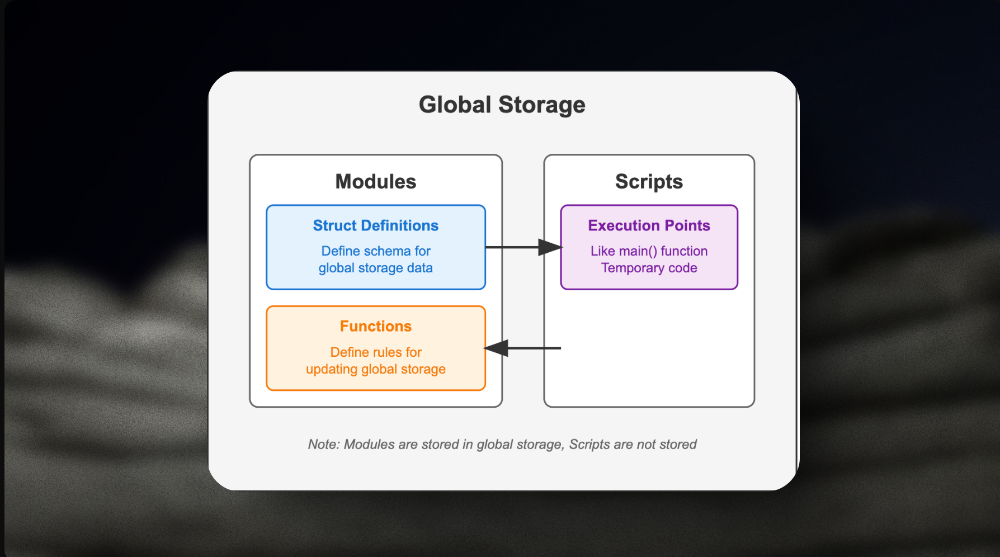
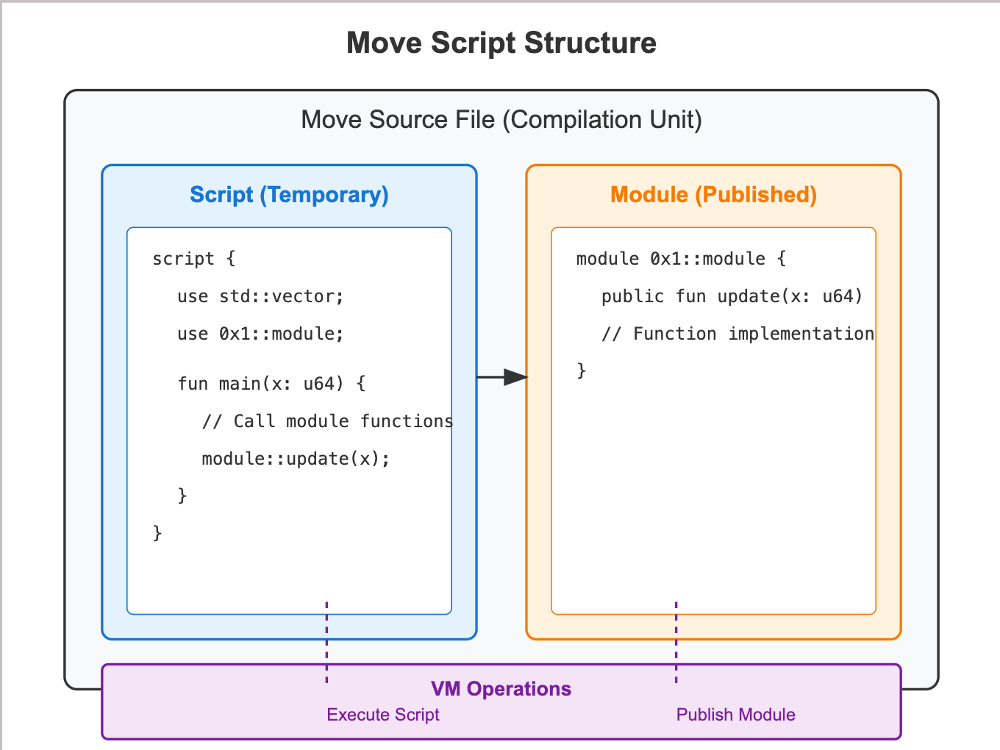

# Modules và Scripts 

Move có hai loại chương trình khác nhau: ***Modules*** và ***Scripts***. Modules là các thư viện định nghĩa các kiểu struct cùng với các hàm thao tác trên những kiểu dữ liệu này. 



Kiểu struct định nghĩa schema của [bộ nhớ toàn cục](https://diem.github.io/move/global-storage-structure.html) trong Move, và các hàm module định nghĩa các quy tắc để cập nhật bộ nhớ. Bản thân các module cũng được lưu trữ trong bộ nhớ toàn cục. Scripts là các điểm thực thi tương tự như hàm `main` trong các ngôn ngữ thông thường. Một script thường gọi các hàm của một module đã được publish để thực hiện cập nhật vào bộ nhớ toàn cục. Scripts là các đoạn code tạm thời không được lưu trữ trong bộ nhớ toàn cục.

Một file nguồn Move (hay **đơn vị biên dịch**) có thể chứa nhiều modules và scripts. Tuy nhiên, việc publish một module hoặc thực thi một script là các thao tác VM riêng biệt.


## Modules là gì ?

Move sử dụng cấu trúc module-based, cho phép developers publish code dưới dạng modules chứa cả phần thực thi và khai báo cấu trúc dữ liệu. Module là đơn vị cơ sở để tổ chức code trong Move. Module được dùng để nhóm và cô lập code, và mặc định tất cả các thành phần của module đều là private (riêng tư). Trong phần này bạn sẽ học cách định nghĩa một module, cách khai báo các thành phần và cách truy cập chúng từ các module khác.


### Cách khai báo một module 
Modules được khai báo bằng từ khóa **`module`** theo sau là địa chỉ package, tên module và phần thân module nằm trong dấu ngoặc nhọn **`{}`**. Tên module nên được viết dưới dạng **`snake_case`** - tất cả chữ thường với dấu gạch dưới giữa các từ. Tên module phải là duy nhất trong package.

Thông thường, một file trong thư mục **`sources/`** chứa một module duy nhất. Tên file phải khớp với tên module - ví dụ, module **`donut_shop`** sẽ được lưu trong file **`donut_shop.move`**. Bạn có thể đọc thêm về quy ước code trong phần **Coding [Conventions](https://www.notion.so/Comments-17a73b50e664803f9432f163feb05b5c?pvs=21)**.


Đây là một module trong move như thế này: 

```rust
module my_address::my_module {
    // module body
}
```

Một module bao gồm các thành phần sau:
* Structs
* Functions
* Constants
* Imports
* Struct Methods


### Module address 
Địa chỉ của module có thể được khai báo theo hai cách: dưới dạng địa chỉ literal (không cần tiền tố @) hoặc dưới dạng địa chỉ được đặt tên trong Package Manifest. Trong ví dụ dưới đây, cả hai cách đều giống nhau vì có một bản ghi book = "0x0" trong phần [addresses] của file Move.toml.

```rust
module 0x0::address_literal { /* ... */ }
module book::named_address { /* ... */ }
```

Phần [addresses] trong file Move.toml:
```rust
# Move.toml
[addresses]
book = "0x0"
```

### Module member 
Các thành phần của module được khai báo bên trong phần thân module. Để minh họa điều này, hãy cùng định nghĩa một module đơn giản với một struct, một hàm và một hằng số:

```rust
module book::my_module_with_members {
    // import
    use book::my_module;

    // a constant
    const CONST: u8 = 0;

    // a struct
    public struct Struct {}

    // method alias
    public use fun function as Struct.struct_fun;

    // function
    fun function(_: &mut Struct) { /* function body */ }
}
```


## Scripts là gì ? 

*Scripts* là các điểm thực thi (entry points) tương tự như hàm `main` trong các ngôn ngữ lập trình thông thường. Script thường gọi các hàm từ module đã được publish để thực hiện cập nhật vào bộ nhớ toàn cục. Scripts là các đoạn code tạm thời và không được lưu trữ trong bộ nhớ toàn cục.



Một file source Move (hay **đơn vị biên dịch**) có thể chứa nhiều modules và scripts. Tuy nhiên, việc publish một module hoặc thực thi một script là các thao tác VM riêng biệt.

Cấu trúc của một script:

```rust 
script {
    <use>*
    <constants>*
    fun <identifier><[type parameters: constraint]*>([identifier: type]*) <function_body>
}   
```

Một  `script` phải bắt đầu với tất cả các khai báo `use` (import), tiếp theo là các `constants` (hằng số) và cuối cùng là khai báo hàm chính. 

Hàm chính có thể đặt tên tùy ý (không nhất thiết phải là `main`), là hàm duy nhất trong khối script, có thể nhận nhiều tham số và không được trả về giá trị. Dưới đây là ví dụ minh họa các thành phần:


```rust 
script {
    // Import the debug module published at the named account address std.
    use std::debug;

    const ONE: u64 = 1;

    fun main(x: u64) {
        let sum = x + ONE;
        debug::print(&sum)
    }
}
```

Scripts có khả năng thực thi khá hạn chế - chúng không thể khai báo friends, định nghĩa struct types hoặc truy cập trực tiếp vào global storage. Mục đích chính của scripts là để gọi các hàm từ module.