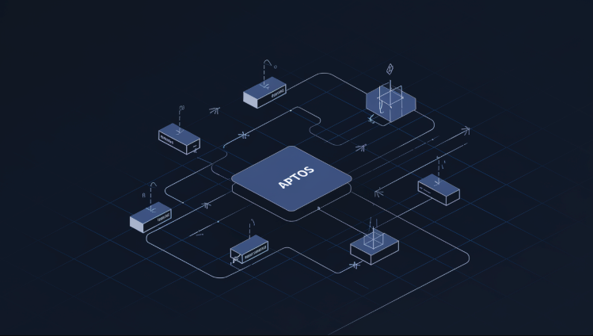

# Transaction là gì ?

Transaction Aptos chứa các thông tin như địa chỉ ví sender, xác thực từ sender, thao tác mong muốn thực hiện trên blockchain Aptos và lượng gas mà người gửi sẵn sàng trả để thực thi giao dịch.

Transactions là thể hiện  thay đổi trạng thái trên blockchain. Ví dụ, việc chuyển token APT được thực hiện thông qua transaction transfer. Tất cả transactions đều được triển khai dưới dạng smart contracts (Move modules) đã được deploy lên blockchain.

Để chi trả cho thời gian thực thi và tài nguyên trên network, việc thực thi một transaction yêu cầu phải trả một khoản phí gas nhỏ. Bạn có thể ước tính phí này bằng cách mô phỏng transaction trước khi gửi nó.

## Transaction states

Từ diagram trên, mình sẽ giải thích flow sẽ bắt đầu từ sender account sẽ bị trừ gas cho bất kỳ giao dịch nào đã được commit. Trong quá trình submit giao dịch, người sender sẽ nhận được thông báo về trạng thái submit thành công hoặc lý do validate thất bại.

Một giao dịch dù đã submit thành công **nhưng cuối cùng bị discard có thể không hiển thị trạng thái trên bất kỳ node Aptos nào hoặc trong mạng Aptos**. 

User có thể thử submit lại cùng một giao dịch để validate lại. Nếu node submit tin rằng giao dịch này vẫn hợp lệ, nó sẽ trả về lỗi thông báo rằng một giao dịch giống hệt đã được submit.

Người gửi có thể thử tăng gas cost một chút để giúp tiến trình được thông suốt và điều chỉnh bất kỳ vấn đề nào có thể gây ra việc discard giao dịch ở downstream.

Bạn có thể đọc chi tiết ( bằng tiếng anh ở đây): https://aptos.dev/en/network/blockchain/txns-states

## Quy trình Tạo và Gửi Giao dịch

### Các bước thực hiện:

1. Xây dựng giao dịch (với tất cả các tham số liên quan)
2. (Tùy chọn) Mô phỏng giao dịch để ước tính phí gas
3. Ký giao dịch (để xác minh quyền thực hiện giao dịch)
4. Gửi giao dịch đến validator
5. Nếu giao dịch hợp lệ, nó sẽ được thực thi trong block tiếp theo

Tất cả các bước này có thể được thực hiện bằng Aptos SDK. Ví dụ, bạn có thể sử dụng TypeScript SDK để thực hiện điều này.

## Life of a Transaction

https://aptos.dev/en/network/blockchain/blockchain-deep-dive

## Tạo một Signed Transaction

Link: https://aptos.web3doc.top/guides/creating-a-signed-transaction/

## Build your first transaction 

https://aptos.dev/en/build/guides/first-transaction