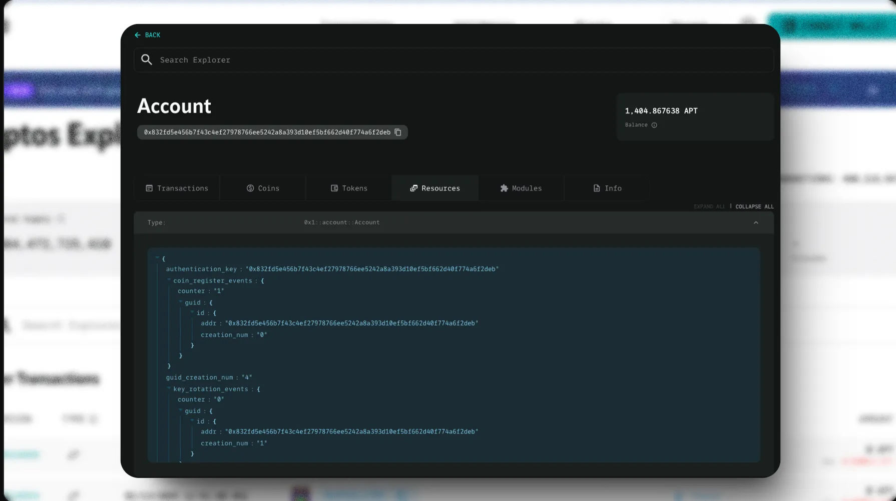
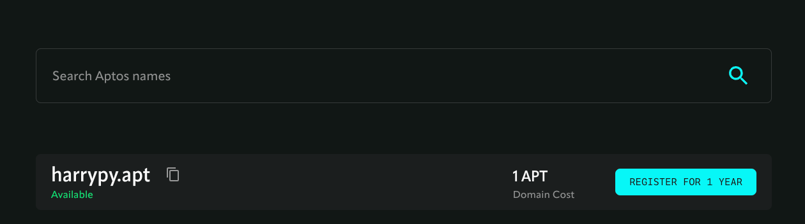
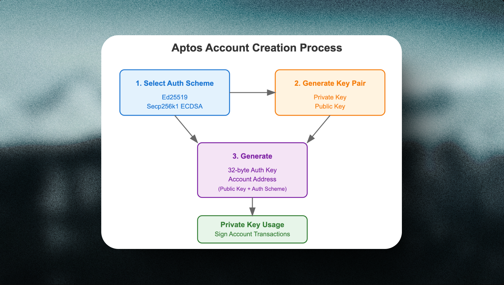
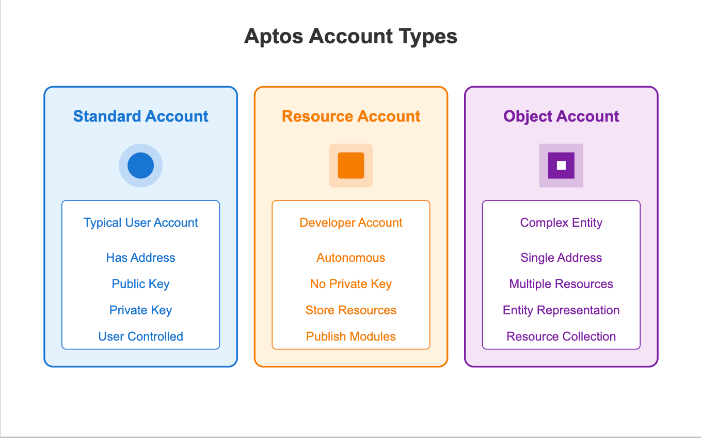
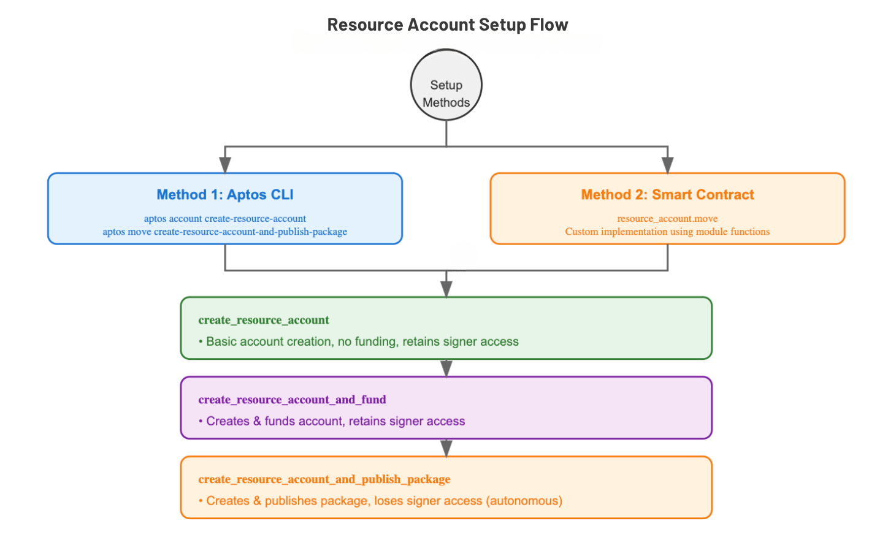

# Account trong Aptos 

Tài khoản trên Aptos đại diện cho việc bạn là ai trên blockchain. Mỗi tài khoản bao gồm một địa chỉ công khai **(public address - để người khác có thể tham chiếu đến bạn**) và **một khóa riêng tư (private key) dùng để xác thực các giao dịch thay đổi state** trên blockchain.

Tài khoản đóng vai trò quan trọng vì chúng lưu trữ các **Resources** (như số dư token hoặc NFT) và có thể chứa mã nguồn (Move modules).

Để tạo tài khoản, bạn cần sinh một khóa riêng tư và nạp tiền vào tài khoản. Trên mạng thử nghiệm (testnet), việc nạp tiền được thực hiện bằng token APT "test" từ "faucet".

Bạn có thể sử dụng [Aptos Explorer](https://explorer.aptoslabs.com/?network=mainnet) để kiểm tra số dư và các tài sản khác trong tài khoản của mình.

Mỗi account trên blockchain Aptos được định danh bằng một địa chỉ 32-byte. Bạn có thể dùng Aptos Name Service tại www.aptosnames.com để đăng ký tên miền .apt cho các tài khoản quan trọng, giúp dễ nhớ và độc nhất.  

Khác với nhiều blockchain khác, Aptos yêu cầu tài khoản phải được thiết lập trước khi có thể sử dụng.
Có hai cách để tạo tài khoản: 

* Trực tiếp (explicit)
* Gián tiếp thông qua việc nhận token APT vào tài khoản đó (implicit). 

## Account address như thế nào ?

Tài khoản trên Aptos được biểu diễn phổ biến dưới dạng chuỗi hex 32-byte. 

**Chuỗi hex ngắn hơn 32-byte vẫn hợp lệ**; trong những trường hợp này, chuỗi hex có thể được đệm thêm các số 0 ở đầu.

ví dụ: `0x1` => `0x0000000000000...01`. Mặc dù tiêu chuẩn Aptos cho phép bỏ các số 0 ở đầu của một Address, hầu hết các ứng dụng hiện nay tránh sử dụng cách viết cũ đó và chỉ cho phép bỏ số 0 ở đầu cho các địa chỉ đặc biệt từ `0x0` đến `0xa`.

## Tạo Account trong Aptos

Khi user request tạo account thông qua Aptos SDK hay Aptos CLI. Thì đây là các steps được thực thi: 

Bạn sẽ chọn Phương Thức Xác Thực (Authentication Scheme):
* Ed25519
* Secp256k1 ECDSA

Để generate cặp Khóa:
* Private Key (Khóa riêng)
* Public Key (Khóa công khai)

Rồi kết hợp Public Key với Authentication Scheme để tạo ra account address và 32-byte authentication key. User có thể sử dụng Private Key  để ký các giao dịch

## Các loại accounts trong Aptos 

Có ba loại tài khoản trong Aptos:

- *Tài khoản tiêu chuẩn (Standard account)* - Loại tài khoản cơ bản mà bạn quản lý bằng cặp khóa private/public, giống như ví điện tử.
- [*Tài khoản resource (Resource account)*](https://aptos.dev/en/build/smart-contracts/resource-accounts) - Loại tài khoản đặc biệt không có private key. Dev sử dụng để lưu trữ dữ liệu và chương trình trên blockchain.
- [*Object*](https://aptos.dev/en/build/smart-contracts/objects) - Tập hợp dữ liệu liên quan được lưu trữ tại một địa chỉ, đại diện cho một thực thể cụ thể trên blockchain.

### Standard account 

Đầu tiên là tài khoản mặc định( Standard account ) trong Aptos -  đây sẽ tài khoản cơ bản mà bạn quản lý bằng cặp khóa private/public, giống như ví điện tử. 

### Resource account 

Thứ hai là tài khoản resource dành cho developer. Đây là loại tài khoản đặc biệt không có private key.  Là tính năng dành cho dev để quản lý các resources độc lập với tài khoản người dùng, cụ thể là để deploy modules và cung cấp quyền kiểm soát truy cập chỉ trên blockchain (ví dụ: signers).

Một [resource account](https://github.com/aptos-labs/aptos-core/blob/main/aptos-move/framework/aptos-framework/sources/resource_account.move) là tính năng dành cho dev để quản lý các resources độc lập với tài khoản người dùng, cụ thể là để deploy modules và cung cấp quyền kiểm soát truy cập chỉ trên blockchain (ví dụ: signers).

Resource account thường được dùng cho 2 mục đích chính:

- Lưu trữ và cô lập resources; một module tạo resource account chỉ để host các resources cụ thể.
- Deploy module như một tài khoản độc lập (resource account), một thành phần trong thiết kế phi tập trung mà không có private key nào có thể kiểm soát resource account đó.

Trong Aptos, tài khoản resource được tạo bằng cách dùng hàm băm SHA3-256 với hai thông tin: địa chỉ nguồn và dữ liệu seed. Mỗi cặp địa chỉ nguồn và seed chỉ có thể tạo được một tài khoản resource duy nhất, vì địa chỉ của tài khoản resource được tính toán trực tiếp từ hai thông tin này.

Cách dễ nhất để tạo resource account là:

1. Dùng Aptos CLI: Lệnh `aptos account create-resource-account` để tạo resource account, và lệnh `aptos move create-resource-account-and-publish-package` để tạo resource account đồng thời deploy package lên địa chỉ của resource account đó.
2. Cách 2 là bạn viết code smart contract: Trong module `resource_account.move`, dev có thể dùng các hàm `create_resource_account`, `create_resource_account_and_fund`, và `create_resource_account_and_publish_package` để tạo resource account trong smart contract của mình.

Mỗi option có chức năng hơi khác nhau:

- `create_resource_account` - Chỉ tạo resource account nhưng không cấp tiền, giữ quyền truy cập vào signer của resource account cho đến khi gọi hàm `retrieve_resource_account_cap`.
- `create_resource_account_and_fund` - Tạo và cấp tiền cho resource account, giữ quyền truy cập vào signer của resource account cho đến khi gọi hàm `retrieve_resource_account_cap`.
- `create_resource_account_and_publish_package` - Tạo resource account và tự động mất quyền truy cập vào resource account (theo thiết kế), vì resource account được dùng để làm cho contract tự chủ và không thể thay đổi.

### Object account 

Objects là một tính năng đặc biệt trên Aptos. Chúng hoạt động giống như một tài khoản nhỏ - có địa chỉ riêng và có thể chứa tài nguyên (resources). Objects rất tiện lợi khi bạn muốn lưu trữ nhiều thông tin phức tạp trên blockchain, vì chúng có thể được sử dụng và chuyển giao như một gói hoàn chỉnh thay vì phải xử lý từng phần riêng lẻ.

Nói đơn giản hơn, trong ngôn ngữ Move, Objects giúp gom nhóm các tài nguyên liên quan lại với nhau để dễ dàng quản lý chúng như một khối thống nhất trên blockchain.

