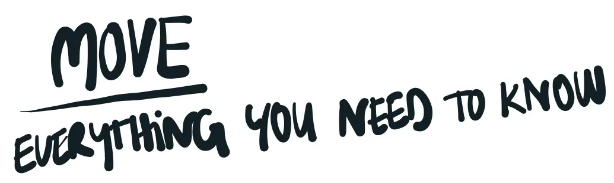
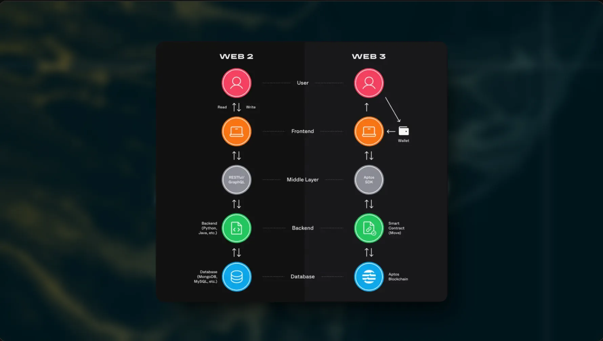
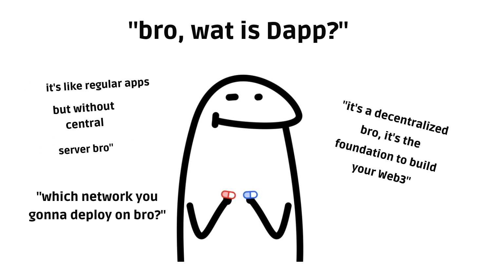

# Web3 101

Sự khác biệt chính giữa phát triển web2 và web3 nằm ở cách xử lý dữ liệu:

- Reading: data trên blockchain sẽ là public và không cần quyền truy cập đặc biệt để đọc
- Writing: Các lần update/ write data ta gọi là blockchain transaction. Bạn cần dùng wallet để approve và sign transaction đó.

## Dapp là gì nhỉ ?

> Dapp? D for ?????

Dapp (ứng dụng phi tập trung) là một ứng dụng hoạt động trên blockchain thay vì máy chủ truyền thống. Nhờ vậy, nó có tính bảo mật cao, minh bạch và khó bị can thiệp hoặc ngừng hoạt động.

Các ứng dụng này sử dụng smart contract - những đoạn mã tự động thực thi dựa trên logic được lập trình sẵn. Điều này cho phép Dapp hoạt động độc lập mà không cần bên trung gian.

Tóm lại, Dapp là những ứng dụng ứng dụng công nghệ blockchain vào thực tiễn.

## Tầm quan trọng của Dapps trong hệ sinh thái Blockchain 

Blockchain là một mạng lưới phân tán gồm nhiều node hoạt động như một máy tính toàn cầu, thực thi logic mà không có sự kiểm soát tập trung và hoàn toàn minh bạch

Dapp đóng vai trò quan trọng trong hệ sinh thái blockchain bằng cách tăng cường tính bảo mật và minh bạch. Do không bị kiểm soát bởi một thực thể duy nhất, chúng có khả năng chống kiểm duyệt. Smart contract cho phép Dapp hoạt động tự chủ, giảm thiểu nhu cầu trung gian và tối ưu chi phí.

